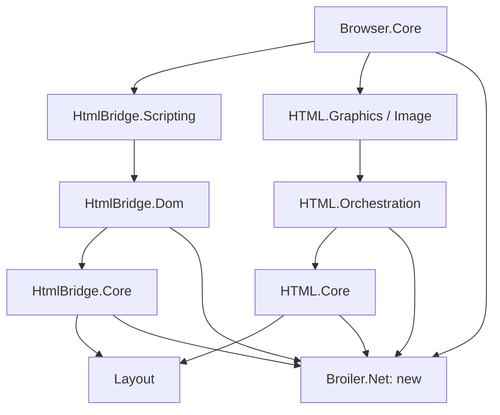

# Cookie support: stage 1 scope and architecture

Stage 1 complete, 2026-09-24. This is a source/package audit and an implementation contract, not a cookie implementation or a runtime conformance claim. Stage 2 was subsequently completed; see [its implementation report](cookie-support-stage-2.md). No production dependency or request behavior changed in stage 1. This document was corrected after the 2026-09-24 audit recorded in that report. Stage 3 has since integrated the request paths; see [its report](cookie-support-stage-3.md), whose inventory table is the current classification.

**Verified source and package baseline**

The machine-readable audit is [cookie-support-baseline.json](cookie-support-baseline.json). It records package versions, NuGet content hashes, source feeds and source commits, the existing restore input hash, standards revisions, and the WPT revision. The audited restore depends on uncommitted Browser edits to `NuGet.config` and the Core and Windows project files: they move HTML to preview.4 and HtmlBridge to preview.5, replace the VM `ProjectReference` to sibling source with a package reference, and remove the GitHub Packages feed. The JSON records their hashes. The other working-tree change, `HtmlPostProcessor` and its tests, is unrelated. All are preserved.

| Component | Resolved by the audited restore (local package cache) | Source alignment |
| --- | --- | --- |
| Browser | Working tree at `04f65ae76139700147d6c6456d4c97bb3366e8c5` | Audit includes current source and project references, including uncommitted changes. |
| HtmlBridge family | `0.1.0-preview.5` from the retired GitHub Packages feed, package commit `f316987bf203d806d05d473ab2631cd55519aac9` | Sibling HEAD `4ba7eabe8e0fb168c25317143a2cb56b8a2f5757` differs in eight files under `src/`: five csproj dependency pins, realm registration (`Window.cs`) and VM compilation handling (`VmCompilationCache.cs`, `VmSourceProvider.cs`). Eleven test, CI/eng, NuGet.config, README and icon files also differ. The cookie stub and HTTP loaders are unchanged. |
| HTML family | `0.1.0-preview.4` from nuget.org, package commit `9b65488d27fa1d755e701dfd6921f343abfb134c` | Sibling HEAD `14870f7b03296a5b26d0a84365cebe8cf95db53a` has the identical full Git tree, `8e56c7a75dabec66db5c0180d1864372dd0a1e7b`. |
| Layout | `0.1.0-preview.5` (commit `96d9752`) from a temporary local folder feed | Used for HTTP identity/protocol configuration and layout callbacks; it does not own a browser cookie store. |
| JSeal / BroilerJs / Vm adapters | `0.1.0-preview.1`, a local build made before JSeal's first commit | No source commit matches; alignment is unverified. Sibling HtmlBridge source now asks for preview.2. Do not assume its newer adapter behavior is in the browser package. |
| JavaScript Engine / Modules | `0.1.0-preview.1` from GitHub Packages, commit `73f071d` | nuget.org serves a different Modules preview.1 build (commit `0c82a60`); the content hash identifies the audited bits. Sibling HtmlBridge source asks for preview.4. Browser does not resolve the separate JavaScript.Network or Debugger packages. |

Evidence comes from current `.csproj` files, the existing Browser Core `project.assets.json`, installed `.nuspec` repository metadata, `.nupkg.metadata` sources, and Git comparisons. The restore contains the VM package; this is evidence for that existing restore, not proof of every build configuration. The audit itself performed no restore or package upgrade. The HTML package commit was fetched into its repository's object database for comparison without changing the checkout.

These versions resolve only from this machine's global package cache. The working-tree `NuGet.config` lists nuget.org only, which carries HtmlBridge only as preview.6 (commit `b139522`, same tree as `4ba7eab`), JSeal as preview.2, Layout as preview.6 and JavaScript.Engine as preview.3/preview.4. A clean-cache restore therefore resolves a different graph (NU1603), and this baseline cannot be reproduced from the current `NuGet.config`; integration must pin versions that nuget.org carries. The JSON lists the 20 packages on the audited request, script and cookie paths, out of 74 `Broiler.*` packages in the Core restore. The Core.Tests restore (2026-09-19: HtmlBridge preview.2, HTML preview.2, Layout preview.4) and the Linux restore (2026-09-16) are stale; re-restore them before gathering test or runtime evidence.

**Request inventory**

Six independent static HTTP clients currently handle browser traffic. Each uses handler defaults (`UseCookies=true`, `AllowAutoRedirect=true`), so each follows redirects itself and keeps its own hidden, process-wide, unpartitioned cookie jar that is never cleared; login state therefore differs between loaders. None receives a shared browser cookie policy or full request context. Probes with the audited packages showed the consequences: bridge Fetch ignores `credentials:'omit'` and sends a page-authored `Cookie` header, an HttpOnly `Set-Cookie` is readable through Fetch headers and XHR `getResponseHeader`, and, with no CORS check, a page can read a credentialed cross-site response. Navigation flows such as the [Google consent flow](google-search-post-consent-challenge.md) rely on H1's jar today, so stage 3 must replace each jar in the same change that disables it. The following source links are pinned to the package commits, except Browser, whose inspected working tree is described above.

| Sink | Source | Lifetime / important behavior | Migration owner |
| --- | --- | --- | --- |
| H1 | [BrowserApp.PageHttpClient / CreatePageHttpClient](https://github.com/Broiler-Platform/Broiler.Browser/blob/04f65ae76139700147d6c6456d4c97bb3366e8c5/src/Broiler.Browser.Core/BrowserApp.cs#L599-L618), [PageLoader](https://github.com/Broiler-Platform/Broiler.Browser/blob/04f65ae76139700147d6c6456d4c97bb3366e8c5/src/Broiler.App/Rendering/PageLoader.cs) | Static process client; navigation/forms; GET loses final redirect URL. | Browser |
| H2 | [ScriptExtractionService](https://github.com/Broiler-Platform/Broiler.HtmlBridge/blob/f316987bf203d806d05d473ab2631cd55519aac9/src/Broiler.HtmlBridge.Core/Scripting/ScriptExtractionService.cs#L46-L47) | Static client, 30-second timeout; text fetch plus local-file dispatch. | HtmlBridge.Core |
| H3 | [ResourceLoader](https://github.com/Broiler-Platform/Broiler.HtmlBridge/blob/f316987bf203d806d05d473ab2631cd55519aac9/src/Broiler.HtmlBridge.Dom/Runtime/ResourceLoader.cs) | Static client, 5-second timeout; bridge stylesheets and `@import`, Fetch/XHR/beacon, and subdocuments. Fetch reports the request URL and `redirected=false` after redirects; frame documents keep the pre-redirect URL. | HtmlBridge.Dom |
| H4 | [ImageDownloader](https://github.com/Broiler-Platform/Broiler.HTML/blob/9b65488d27fa1d755e701dfd6921f343abfb134c/Source/Broiler.HTML.Core/Handlers/ImageDownloader.cs) | Static client, 5-second timeout; sync/worker downloads with cancellation. | HTML.Core |
| H5 | [StylesheetLoadHandler](https://github.com/Broiler-Platform/Broiler.HTML/blob/9b65488d27fa1d755e701dfd6921f343abfb134c/Source/Broiler.HTML.Orchestration/Handlers/StylesheetLoadHandler.cs) | Static client, 5-second timeout; renderer stylesheet loading. | HTML.Orchestration |
| H6 | [HtmlContainerInt font loading](https://github.com/Broiler-Platform/Broiler.HTML/blob/9b65488d27fa1d755e701dfd6921f343abfb134c/Source/Broiler.HTML.Orchestration/HtmlContainerInt.cs#L608) | Static client, 10-second timeout; downloads to a temporary file for font decoding. | HTML.Orchestration |

Here, **active** means a network path exists and must be integrated; **local/stub** means no network request is implemented for that surface; **unsupported** means the browser capability is missing. No path is already integrated with the proposed cookie service.

This table is the stage 1 classification. Stage 3 changed R01–R19. Most active paths are now integrated; R04, R09, R11, R13 and R17 are integrated with remaining limits. Inserted module scripts (R05) and scanner script preload hints (R06) remain unsupported, and R18–R19 remain local with `file:` reads limited to `file:` documents. R20–R25 are unchanged. The [stage 3 inventory](cookie-support-stage-3.md) gives each row's current status.

| ID | Trigger / caller | Current route and classification | Required context or prerequisite |
| --- | --- | --- | --- |
| R01 | Address bar, startup URL, favorites, links, back/forward/reload, GET forms | Browser navigation → RenderingPipeline → H1; active | Initiator, navigation kind, prior site, final URL. |
| R02 | POST/multipart forms, meta refresh and script-triggered navigation | PageRequest / pending NavigationRequest → H1; active | Original method/body, source document (for meta refresh, the refreshing document), redirect history. |
| R03 | External classic, async, deferred scripts and module roots | ExtractAll → FetchExternalScript → H2; active | Owning document, script kind, crossorigin/credentials. |
| R04 | Static imports and `import()` from module scripts | BridgeModuleContext.ReadModuleSourceAsync → H2, only when the document has at least one module root; active. `import()` from a classic script rejects without a request; unsupported | Module referrer for resolution; document context for policy. |
| R05 | Dynamically inserted classic external scripts | ScriptInsertionRunner → H2; active. Inserted module scripts are marked started without a fetch; unsupported | Element's owning document and script options. |
| R06 | Script speculation and script preload hints | ScriptExtractionService.CreateScriptPrefetcher issues `<script src>` requests early inside ExtractAll when a page has at least two external scripts → H2; active. PreloadScanner script, `modulepreload` and `preload as=script` candidates are recognized but never requested; unsupported | Same context as eventual consumer; speculation is an actual request. |
| R07 | Bridge link sheets, `@import` sheets, CSSOM-triggered loading | StyleSheets / Css → ResourceLoader.LoadText → H3; active. The only path that fetches `@import` | Document identity separate from sheet URL/base. |
| R08 | Bridge speculative stylesheet scan (`rel=stylesheet` and `rel=preload as=style`) | HtmlParsing.StartSpeculativePreloadScan → H3; active. Preload-as-style hints are fetched even when nothing consumes them | Capture immutable context before queueing; handle reparse/disposal. Unconsumed hints follow the same cookie rules. |
| R09 | fetch(), including Request input | FetchBinding.Callbacks → H3; active | Request credentials/mode, initiator, forbidden headers, CORS; final URL and redirect chain (`Response.url` and `redirected` are currently wrong after redirects). |
| R10 | XMLHttpRequest | JS polyfill → fetch → H3; active | withCredentials currently exists but is not passed to Fetch. |
| R11 | navigator.sendBeacon | BeaconBinding → window.fetch → H3; active | Explicit beacon credentials/mode. `keepalive` is set but ignored: the fetch is synchronous, so beacon lifetime beyond the document is a prerequisite. |
| R12 | iframe/object/embed document resources | DomBridge.TryFetchSubResource (SubDocuments.cs:478) handles about:blank, data:, local-base/WPT and file: before HTTP via ResourceLoader.GetAsync (:547) → H3; active | Child document URL (currently the pre-redirect URL), ancestor sites, sandbox/origin and final URL. |
| R13 | Scripts and fetch inside frames | Frame script extraction uses H2; subwindow republishes parent fetch/XHR functions; active | Bind operations to the correct frame, not just the top-level bridge URL. |
| R14 | Renderer `` and CSS background images | Layout ILayoutImageLoader → ImageLoadHandler → H4; active. A cache hit skips the network; `` and CSS images arrive through the same call, so the seam cannot tell them apart | Owning context and crossorigin policy; bypass unsafe cache hits. |
| R15 | Layout image prefetch | Layout image callbacks → same image loader/H4; active | Same cache partition and context as ordinary image loading. |
| R16 | Renderer stylesheets | DomParser → IStylesheetLoader → H5; active. The renderer never fetches `@import` (Broiler.CSS only parses it); imports go through R07 | Same service and document context as bridge sheets. |
| R17 | CSS @font-face | HtmlContainerInt.LoadFontFacesFromStyleSet → H6; active. Relative font URLs ignore `<base>`; remote fonts enter a process-global font registry | Anonymous CORS font credentials, document context; a per-container font scope so font state cannot cross documents or profiles. |
| R18 | file:, inline/srcdoc, decoded data: resources | Local reads, inline parsing, or data decoding; local | No HTTP cookies; inherited documents still need an explicit effective origin for script APIs. |
| R19 | Dedicated Worker / importScripts | ResolveWorkerScript accepts file-shaped sources; worker global has no Fetch/XHR; local-only | Network worker loader and worker request context are prerequisites. |
| R20 | VM document-free module resolution | VmModuleMap uses already-declared module roots; no guest-triggered network load | Do not invent a second network route. Interactive VM configuration currently delegates DOM work to ScriptEngine/Broiler.JS. |
| R21 | FontFace.load / document.fonts | Polyfill changes state/resolves promises without downloading; stub | Actual font-loading API prerequisite; CSS fonts still use R17. |
| R22 | audio/video/MediaSource | MediaCapabilityBinding advertises unavailable playback; no media HTTP loader found; unsupported networking | Media network transport and range requests prerequisite. Media library consumes supplied streams. |
| R23 | WebSocket / EventSource | No browser bindings or HTTP handshake path found; unsupported | Bindings/transport prerequisite; future traffic must use profile policy. |
| R24 | ServiceWorker / SharedWorker / module workers | Not implemented in the audited browser paths; unsupported | Worker lifecycle, origin, fetch and permission infrastructure. |
| R25 | Cookie Store / Storage Access APIs | No browser API implementation found; unsupported | Stage 7 plus required secure-context/permission infrastructure. |

Only stylesheet candidates reach the preload scanner's network sink (HtmlParsing.cs:216). Its script (including `modulepreload`), image and frame candidates are recognized but not fetched; script speculation happens only through CreateScriptPrefetcher over `<script src>` (R06). Image prefetch from Layout is a separate implemented route (R15). General hint support must not be inferred from a scanner recognizing a tag.

Excluded from browser traffic: the HTML Win32 demo's standalone client, JavaScript.Network's optional fetch service, and the JavaScript debugger's ClientWebSocket. The latter two are not in Browser's audited resolved dependency set or installed by its composition. This classification must be revisited if those components are enabled.

**Dependencies and ownership decision**

Create a BCL-only `Broiler.Net` package targeting net10.0 during stage 2, with its own unit-test project. It owns reusable request context, cookie algorithms, site resolution, and policy-aware HTTP transport. It must not depend on Layout, HTML, DOM, HtmlBridge, a JavaScript engine, Browser, UI, or SQLite. No existing Broiler.Net project/reference was found in the audited workspaces/release metadata.

**Package name.** Keep `Broiler.Net`; `Broiler.Session` was considered and rejected. The package holds network-layer state and transport, the scope of Chromium's //net and Firefox's netwerk. "Session" already names session cookies, DomBridge sessions, `InteractiveSession` and `UiSession`, and Browser, not the package, owns profile and session lifetime. Namespaces are `Broiler.Net.Cookies`, `Broiler.Net.Sites` and, from stage 3, `Broiler.Net.Http` for the transport. `BroilerUserAgent` and `BroilerHttpProtocol` move from `Broiler.Layout.Net` into `Broiler.Net.Http` in stage 3; Layout keeps its copy until its next release.

Terminology: the *profile network session* is the Browser-owned, profile-scoped transport and cookie state. A *DomBridge (document) session* is one bridge attached to one document, configured by `DomBridgeSessionOptions`. `InteractiveSession` is the HtmlBridge handle that keeps one page's script execution live for Browser's load and animation loop. A *session cookie* is a non-persistent cookie in the 6265bis-22 sense; it ends with the profile network session. Use the qualified term; "session" alone is ambiguous here.

The relevant proposed dependency graph is below; arrows mean "depends on". Unrelated rendering and platform packages are omitted.

Browser owns `BrowserProfile`, the profile directory, persistence adapter, cookie settings and UI, and lifetime of its network session. HtmlBridge owns document/frame context creation and script bindings. HTML owns propagation into renderer containers, image/stylesheet/font loaders and caches. Layout retains its loader callbacks; it must not gain a global cookie jar. JavaScript providers receive host operations and do not implement cookies themselves.

Keeping this below HTML and HtmlBridge avoids adding an HTML → HtmlBridge → Layout ownership cycle or making the renderer depend on the browser application. The contract names below were design targets, not available APIs; the note after the table records which stage delivers each.

| Contract | Responsibility and invariant |
| --- | --- |
| `BrowserNetworkSession` / `IBrowserRequestTransport` | Profile-scoped SendAsync operation accepting a request and mandatory RequestContext; returns status, final URL, redirect history, response header fields, and a disposable body. Preserve repeated header values. No implicit process-global profile fallback. |
| `DocumentRequestContext` | Immutable document URL, effective origin, top-level site, ancestor/site-for-cookies state and partition identity. Represent opaque origins explicitly; never substitute an empty string or the HTML base URL. |
| `RequestContext` | Document context plus destination, method, initiator, Fetch mode, credential mode, navigation kind, redirect history and lifecycle generation. Construct in trusted host code, not from script-authored Cookie headers. |
| `CookieAccessContext` | Common access inputs, with distinct HTTP and non-HTTP access modes. Avoid a public boolean that lets script bindings claim HttpOnly privileges. |
| `ICookieService` | Separate receive-response-cookie, build-request-header, get-document-cookies and set-document-cookie operations; all pass through common acceptance/retrieval policy. Return typed decisions/reasons for diagnostics, without exposing secrets. |
| `CookieRecord` / `CookieKey` | Parsed attributes, timestamps, host-only state, and partition identity. Replacement identity follows the pinned algorithm; records are not keyed by name alone. |
| `ISiteResolver` / `CookiePolicy` | Distinguish origin from schemeful site, use pinned PSL, derive SameSite/partition policy, apply settings. Do not collapse same-origin and same-site into one test. |
| `ICookiePersistence` | Snapshot/delta persistence abstraction only. SQLite, file locations and key protection remain Browser-owned. Cookie reads never wait on disk. |
| Clock / change notifications | Use TimeProvider for expiry tests; publish changes outside store locks; DOM adapters schedule events on their own realm thread. |

Stage 2 delivered `ICookieService`, `CookieRecord`/`CookieKey`, `ISiteResolver`, `CookiePolicy`, TimeProvider-based expiry and change notifications. `CookieAccessContext` became two records: `CookieRequestContext` (HTTP) and `CookieDocumentContext` (non-HTTP). `CookiePolicy` decisions are internal and exercised through `CookieStore`. The caller currently supplies same-site status, the top-level-navigation flag and the partition key; deriving them from document, ancestor and redirect context moves to stage 3, and user settings to stage 5. `BrowserNetworkSession`/`IBrowserRequestTransport`, `DocumentRequestContext` and `RequestContext` move to stage 3 (`Broiler.Net.Http`); `ICookiePersistence` moves to stage 6. Stage 3 delivered the transport contracts; its report lists the names and shapes as built.

Use a context-bearing result from PageLoader in place of treating `(url, html)` as sufficient. The session must reach three separate entry points: `ScriptExtractionService.ExtractAll`, which is static and runs before any bridge exists; the DomBridge factory through `DomBridgeSessionOptions`, which Browser does not supply at all today; and the renderer container, the only consumer on script-free pages, for which `ExecuteInteractive` creates no bridge. Pass it into both the visible HTML container and any headless measurement container. A renderer rebuild or DOM reparse borrows the same profile session; it must not create or clear a cookie store. Frame documents derive child contexts and receive correctly bound Fetch/DOM cookie accessors.

The network session owns redirect iteration and the send/receive cookie boundary. The existing handler jars are live (see the request inventory): replace each client's jar with the profile session in the same change that disables its handler cookies and redirects, so flows that rely on H1's jar keep working. Preserve streaming, cancellation, timeouts, User-Agent and connection pooling. Resource adapters may synchronously wait where the current renderer requires it; the session itself must not capture the UI synchronization context.

**Required integration fixes discovered by this audit**

| Finding | Evidence | Required completion gate / owner |
| --- | --- | --- |
| Every HTTP client keeps a hidden automatic cookie jar; bridge Fetch/XHR expose it to scripts and across sites. | Handler defaults in H1–H6; runtime probe with the audited packages | Replace each jar with the profile session in the same change that disables it; stage 3 (H1–H6), with the stage 4 Fetch/XHR gates. |
| JavaScript cookie storage is a document-local append-only string. | Registration.cs:507 and WindowDocumentMiscBinding.cs:120 | Shared document accessors, including frames; stage 4, HtmlBridge. |
| Fetch does not enforce credentials options on its send path; XHR ignores withCredentials in its fetch options. | FetchBinding.Objects stores credentials; Callbacks does not read them; Xhr.cs:340 calls fetch. | HTTP send and receive eligibility plus API tests; stage 4, HtmlBridge/Net. |
| Fetch copies all response headers into a script-visible dictionary and accepts arbitrary request headers except selected content handling. | FetchBinding.Callbacks.cs:153–202 | Set-Cookie filtering, forbidden request headers and CORS; stage 4. Do not broaden shared-cookie exposure before this is ready. |
| Image cache uses URL-derived files in the shared temporary HtmlRenderer directory. | ImageLoadHandler.SetImageFromUrl and CommonUtils.GetLocalfileName | Profile/partition isolation and credential-aware cache policy; stage 3, HTML. Start with bypassing legacy cache for migrated requests until correct caching exists. |
| Prefetch jobs can outlive a parse; ResourceLoader holds pending work. | HtmlParsing.cs and SubResourcePrefetcher | Capture context and generation at enqueue; explicit invalidation on clear/disposal; stage 3. |
| Request objects do not carry navigation origin/type; some responses lose redirect identity. | PageRequest, GET PageLoader path, Fetch `Response.url` (FetchBinding.Callbacks.cs:198), frame location (SubDocuments.cs:190) | Accurate context and final URLs through navigation, Fetch and frame creation; stage 3, Browser/HtmlBridge. |
| Per-profile cookie plumbing cannot be added through current Browser constructor arguments alone. | Static clients; DomBridgeSessionOptions has only LayoutViewFactory, and Browser supplies no options at all | Publish lower-level API additions before Browser integration; stages 2–4. |
| A VM build is not evidence of an independent VM DOM cookie implementation. | VmScriptEngine.ExecuteInteractive delegates to its document engine | Test configurations and actual provider capabilities separately; stages 4/8. |

These are implementation prerequisites, not fixes included in this document. The first integrated release must combine transport migration with the necessary script access restrictions; a shared jar must not ship while the existing Fetch exposure bypasses its boundaries. The hidden H3 jar already has this exposure today.

Stage 3 addressed every row except the last (an independent VM provider test), with the limits recorded in its report. For the image cache, transport loads now bypass the shared temporary cache; the cookie-less fallback still uses it. The lower-level API additions are built but not yet published.

**Compatibility baseline and behavior matrix**

Pin the cookie engine to [6265bis-22](https://datatracker.ietf.org/doc/html/draft-ietf-httpbis-rfc6265bis-22), plus explicit browser integration from the pinned Fetch/HTML revisions. The IESG approved -22 on 2025-12-02; it is in the RFC Editor queue, in final review since 2026-08-13, with no RFC number yet. When the RFC is published, re-pin to it and diff it against -22. The [layered-cookies-02 draft](https://datatracker.ietf.org/doc/html/draft-ietf-httpbis-layered-cookies-02) was reviewed: it reorganizes cookie processing, would obsolete 6265bis, moves same-site computation out of the cookie layer into Fetch, adds the `__Http-` and `__Host-Http-` prefixes, and starts a cookie without SameSite as "unset" instead of Lax-by-default, so pinned Fetch sends such cookies on cross-site-initiated navigations and in frames with a cross-site ancestor. Track its changes separately; do not combine algorithms from moving revisions without updating this matrix and its fixtures. Both IETF documents remain drafts; this is not a claim of published RFC conformance.

The exact Fetch, HTML, CHIPS, Cookie Store, PSL, and WPT Git commits are in the JSON audit.

**Reference layering.** All cookie parsing, storage and retrieval semantics come from 6265bis-22. The other pinned documents build on different cookie texts: Fetch's cookie hooks call layered-cookies algorithms, HTML's document.cookie cites RFC 6265, Cookie Store cites 6265bis-14, and the CHIPS spec draft cites earlier 6265bis revisions. They supply context only: Fetch the credentials mode, destination, initiator, redirect chain and cross-site ancestry; HTML document cookie access and cookie-averse documents; CHIPS the partition key; Cookie Store a later API surface. Mapping onto 6265bis-22: network requests use the HTTP retrieval type and script APIs the non-HTTP type. Same-site status follows §5.2: compare the site for cookies, computed over the ancestor chain, with the request URL; the request is also cross-site when any URL in its redirect chain is cross-site, and the §5.2 reload rule applies. Fetch's "determine the same-site mode" is not followed literally, because it contradicts the pinned WPT SameSite tests; for example, it withholds Strict cookies from a same-site top-level GET. Layered-cookies terms (`unset`, `strict-or-less`, `lax-or-less`, `unset-or-less`) are not used.

Applicable references: [Fetch](https://fetch.spec.whatwg.org/), [HTML document.cookie](https://html.spec.whatwg.org/multipage/dom.html#dom-document-cookie), [CHIPS](https://github.com/privacycg/CHIPS), [Cookie Store](https://cookiestore.spec.whatwg.org/).

The table describes the **target**, not current conformance. "Eligible" always also requires domain/path, security, SameSite, partition and user-policy checks. Credential mode alone never authorizes a cookie.

| Surface / case | Target send and receive behavior | Script visibility / required verification |
| --- | --- | --- |
| Top-level navigation and forms | Include eligible cookies and process eligible response cookies at each hop. | Separate safe/unsafe navigation and reload tests, including cross-site redirects. |
| Frame navigation | Include eligible cookies with child/ancestor context; no top-level navigation exemption. | Same-origin access and sandbox rules; distinct document accessor tests. |
| Classic scripts, images, external stylesheets | Default resource-specific include behavior; anonymous crossorigin limits credentials to same-origin; use-credentials includes eligible cookies. | Test both HTML and bridge loading paths; `@import` is bridge-only (R07) and dynamic insertion is classic-only (R05). |
| Module scripts and imports | Same-origin credentials by default; use-credentials follows module graph settings. | Cross-origin module graph fixtures; retain root credentials across imports. |
| CSS font loads | Anonymous CORS loading with same-origin credentials. | Protected same-origin font works; unrelated cross-origin cookies are withheld. |
| Fetch omit | Neither send cookies nor accept response cookies. | Existing same-origin cookie remains unchanged after a response tries to replace it. |
| Fetch same-origin / include | Eligibility follows actual origin and redirect chain; include still applies all cookie policy. | Reject the Fetch forbidden request headers, including `Cookie` and `Cookie2`; never expose `Set-Cookie` or `Set-Cookie2`. CORS response visibility is evaluated separately from cookie storage. |
| XHR | Map false to same-origin and true to include; same-origin cookies work with false. | Response-header filtering and credentialed CORS/preflight tests. |
| Beacon | Include eligible cookies under beacon request rules. | Test a cross-origin endpoint and subsequent eligible read/request, not just the queued return value. |
| document.cookie | Shared store with non-HTTP access semantics. | Only visible name/value pairs; correct overwrite/deletion; HttpOnly inaccessible and protected from script mutation. |
| Partitioned cookies | The partition key is (top-level schemeful site, cross-site-ancestor bit), per the pinned CHIPS spec draft (`spec/draft-cutler-httpbis-partitioned-cookies.md`; the README at that commit still describes a top-level-site-only key). Partitioned requires Secure. | HTTP and script paths use the same key derivation; coexistence with unpartitioned entries; an A→B→A frame chain; the pinned WPT `partitioned-cookies` redirect and a-b-a-embed tests. |
| Persistent/session cookies | Persist eligible persistent records only; session cookies end with the profile network session by default. | Restart, expiry, clear, and interrupted-write tests. |
| Non-HTTP documents | Pinned HTML makes every document whose URL is not HTTP(S) cookie-averse (file:, data:, about:blank, about:srcdoc): the getter returns an empty string and the setter does nothing, checked before the opaque-origin SecurityError. Deliberate deviation: an about:blank or srcdoc document whose origin matches its creator uses the creator document's cookie URL. | Changing a base element cannot change cookie ownership. A sandboxed srcdoc returns an empty string without throwing. |
| Cookie Store | Same underlying access/policy engine; secure-context API and scheduled events. | Stage 7; service-worker subscriptions remain gated by worker capability. |

Browser product choices for the first implementation are explicit:

| Choice | Decision / compatibility consequence |
| --- | --- |
| Default SameSite | Follow 6265bis-22: a cookie without a valid SameSite value is enforced as Lax, without the optional Lax-allowing-unsafe grace period. This deviates from pinned Fetch plus layered-cookies-02, where such cookies are "unset" and sent on cross-site-initiated navigations and in cross-site frames, and matches the pinned WPT SameSite expectations. Cross-site POST fixtures document the choice. |
| Third-party setting | Allow standards-eligible cookies initially, with block-all and block-unpartitioned-third-party options and site exceptions. Partitioned cookies remain subject to security rules and block-all. |
| Local files | Required by HTML, not a product choice: file: documents are cookie-averse, so there are no file-scheme cookies. The current document.cookie stub violates this. Use HTTPS test origins for cookie conformance. |
| Session restoration | Session cookies are not restored after profile shutdown. A future restore feature requires a separate documented policy. |
| Prefix/experimental extensions | Implement prefixes in the pinned core baseline. `__Host-` requires an explicit `Path=/` attribute (pinned WPT, layered-cookies), stricter than 6265bis-22 §5.7 step 21.3; step 1 permits ignoring the cookie. Track `__Http-`, `__Host-Http-` and origin-bound proposals as explicit extension work, not inferred support from ignoring unknown attributes. |
| Unsupported APIs | Network workers, service workers, WebSocket, EventSource, media streaming and Storage Access cannot count as passing cookie surfaces until their prerequisites exist. Window Cookie Store is in stage 7. |

**Versioned verification and handoff**

WPT is pinned to `e35344a20f922751f5ea8cc678cfd79d65056d5c`. The `cookies`, `cookiestore`, `fetch`, `xhr`, `clear-site-data`, `storage-access-api` and `html/dom/documents/resource-metadata-management` (document-cookie.html) directories were verified at that revision. Relevant cookie subdirectories include attributes, domain, encoding, name, value, path, ordering, prefix, secure, samesite, schemeful-same-site, samesite-none-secure, size, partitioned-cookies and third-party-cookies, plus the top-level `cookies/*.html` tests. Experimental origin-bound tests must be classified separately. No WPT or runtime tests were executed in this documentation-only stage.

Stage 2 owns pure parser/store/site-policy fixtures with a fake clock. Stage 3 owns multi-origin HTTP/HTTPS and real-loader fixtures for R01–R17. Stage 4 owns document/Fetch/XHR/header/CORS fixtures, including frame rebinding. Stage 5 owns settings and partition cases. Stage 6 owns persistence, clearing and lifecycle races. Stage 7 owns modern API fixtures and named unsupported prerequisites. Stage 8 combines the matrix across OS/configuration/provider capabilities; unsupported is a distinct result, never a pass.

Package handoff order: create and test Broiler.Net; add and test HTML/HtmlBridge integration APIs against a task-local package feed; update all consuming family references coherently; verify restores and integration tests for each supported configuration; publish only when separately requested. Retain nuget.org as the normal source and avoid committing machine-specific absolute project references. Current packages must not be overwritten under their existing versions.

Stage 1 exit check: request paths classified; six HTTP sinks identified; package/source differences verified; dependency direction and contract ownership selected; compatibility choices and prerequisite matrix recorded; standards and test revisions pinned. Stage 2's BCL-only cookie engine and stage 3's transport and loader integration have since been completed, though not yet committed or published; see their reports.
