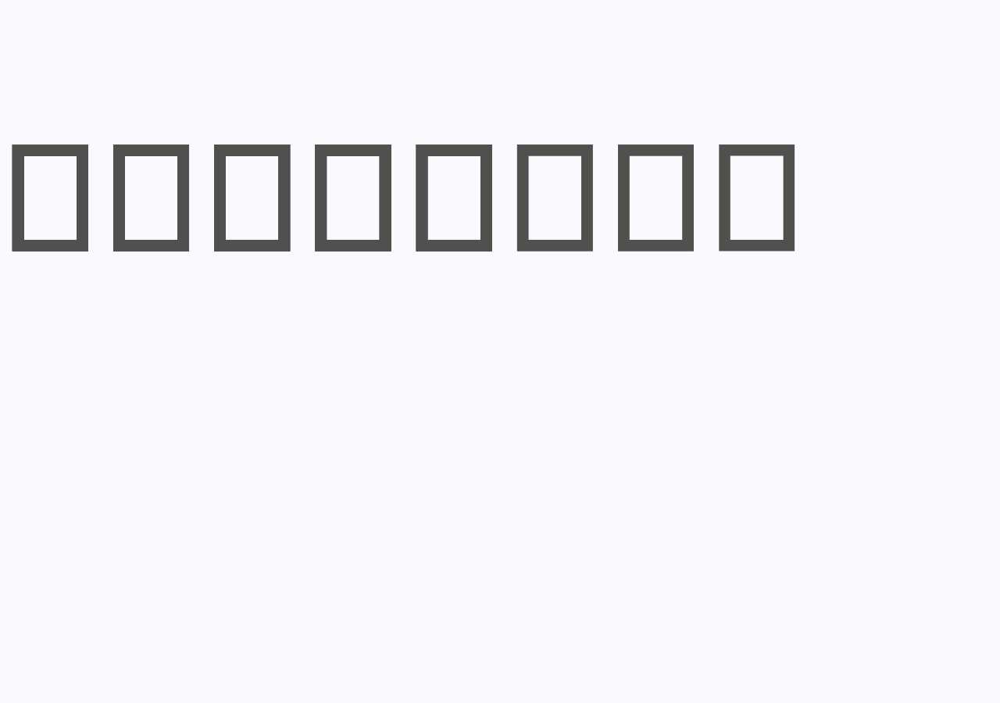

# CreepJS rendering investigation and repair plan

Investigated on **2026-10-09**, using Broiler.Browser CLI against
[CreepJS](https://abrahamjuliot.github.io/creepjs/).

**P0 follow-up:** the native proxy-recursion crash is now fixed in the local
Broiler.JS checkout. The unmodified live site completes CLI analysis, the separate
BrowserApp window pass, and image capture with the patched assembly. See
[the P0 fix and validation notes](creepjs-p0-fix-2026-10-09.md). The findings below
describe the original baseline; the P1/API blockers remain.

**The unmodified live site crashes Broiler before an image is written.** Both
`--analyze` and `--capture-image` terminate with Windows stack-overflow status
`0xC00000FD` (`-1073741571`, or unsigned `3221225725`). The immediate blocker is
unbounded JavaScript property lookup through a proxy/prototype cycle.
Downloading the page is successful. Increasing the network timeout will not fix it.

Reduced probes and explicitly modified local replays also expose DOM constructor,
window-indexing, console, and graphics API gaps. This document records the findings
and an implementation/acceptance plan. No production fixes were made during the
initial investigation; the P0 follow-up above records the subsequent code change.

## Environment and evidence

Browser HEAD: `2867527cda36eb5b8aa880b86130c11d1b25ccd4`, with pre-existing
uncommitted package, CLI and Sannysoft changes. Those changes were preserved and
included in the build. The CLI was built into an isolated artifacts directory,
without replacing the ordinary `src/.../bin` outputs.

Windows x64 build 26200; .NET SDK 10.0.401; runtime 10.0.12; Release; viewport
1280×900. Build: **zero warnings, zero errors**.

| Component | Loaded version |
| --- | --- |
| Broiler.JavaScript | 0.1.0-preview.6, commit `df80fc075a770b72c795cabe680b7fd94f7a4d55` |
| Broiler.HtmlBridge | 0.1.0-preview.23, commit `4d6313c231ce8407153b19930c9fc846347fc20e` |
| Broiler.HTML | 0.1.0-preview.25 |
| Broiler.Layout | 0.1.0-preview.21 |
| Broiler.CSS | 0.1.0-preview.16 |
| Broiler.DOM | 0.1.0-preview.14 |

[Observed evidence](repros/creepjs-observed-2026-10-09.json) preserves the component
versions, binary and downloaded-resource SHA-256 hashes, network results, crash
excerpt, reduced-probe results and replay outcomes. The full logs, downloaded
resources and generated HTML reports remain in
[`artifacts/creepjs-2026-10-09`](../artifacts/creepjs-2026-10-09/), which is ignored
by Git. The JSON and reproduction pages under `docs/repros` are durable evidence.

HtmlBridge source inspection used the matching sibling checkout. The JavaScript
checkout HEAD is newer (`e0d9fa6b7d0ced1f48c12997e158b3c80438a664`); the proxy
lookup was also checked with `git show` at the loaded package's commit.

## Reproduction

Run from `D:\Broiler.Browser` in PowerShell:

```powershell
dotnet build src/Broiler.Browser.Cli/Broiler.Browser.Cli.csproj -c Release `
  --artifacts-path D:/Broiler.Browser/artifacts/creepjs-2026-10-09/build
$cli = 'artifacts/creepjs-2026-10-09/build/bin/Broiler.Browser.Cli/release/Broiler.Cli.dll'

dotnet $cli --analyze https://abrahamjuliot.github.io/creepjs/ `
  --output-dir artifacts/creepjs-2026-10-09/live `
  --width 1280 --height 900 --analysis-timeout 180 --verbose `
  *> artifacts/creepjs-2026-10-09/live-run.log
$LASTEXITCODE

dotnet $cli --capture-image https://abrahamjuliot.github.io/creepjs/ `
  --output artifacts/creepjs-2026-10-09/capture.png `
  --width 1280 --height 900 `
  --diagnostic-dir artifacts/creepjs-2026-10-09/capture-diagnostics `
  *> artifacts/creepjs-2026-10-09/capture-run.log
$LASTEXITCODE

# This reduced test also crashes affected builds; keep it in a child process.
dotnet $cli --evaluate-page docs/repros/creepjs-proxy-cycle.html `
  --evaluate "document.getElementById('result').textContent" `
  --output artifacts/creepjs-2026-10-09/reduced-cycle.json

dotnet $cli --evaluate-page docs/repros/creepjs-platform-probes.html `
  --evaluate 'JSON.stringify(observations)' --width 1280 --height 900 `
  --output artifacts/creepjs-2026-10-09/platform-probes.json
```

The live analysis fetched the document (8,331 bytes), `creep.js` (550,117 bytes),
and `style.min.css` (217,563 bytes), all with HTTP 200. It entered scripts at
2.141 seconds and failed shortly after the last exception at 5.840 seconds.
No live screenshot or final analysis report was produced. The separate
BrowserApp/window phase was never reached, so a successful desktop-window render
has **not** been demonstrated.

## Repair priorities

| Priority | Problem | Owner | Completion criterion |
| --- | --- | --- | --- |
| P0 — locally fixed | Proxy prototype recursion terminates the host | Broiler.JS | Verified: reduced case produces a catchable RangeError; unmodified live CLI survives the advanced proxy probes. |
| P1 | `new DocumentFragment()` throws | HtmlBridge | Constructor creates a real fragment with correct owner/prototype and insertion semantics. |
| P1 | `window[0]` is undefined despite an inserted iframe | HtmlBridge | Numeric window access resolves the same child as `frames[0]` and `contentWindow`, including updates. |
| P1 | Console grouping methods are absent | HtmlBridge | Group calls execute without rejecting the page's main async function. |
| P1 investigation | Rendering still rejects after diagnostic bypasses | HtmlBridge / JS | Isolate the remaining `cssMediaHTML` failure; unmodified page reaches its result DOM. |
| P2 | Missing/incomplete fingerprinting APIs | HtmlBridge, Graphics, Media, Layout | Independently verified API behavior or truthful unsupported results; no fabricated fingerprints. |
| P2 | Native crashes prevent the final diagnostics report | Browser CLI | Parent process records child failure and preserves a useful incomplete report. |

Priorities describe site compatibility and process stability, not a security assessment.

## 1. Proxy/prototype cycles exhaust the native stack

The fetched script's advanced proxy test at `creep.js:881–885` sets a proxy's
prototype to an object inheriting from that same proxy, then accesses `toString`.
The independent [reduced page](repros/creepjs-proxy-cycle.html) reproduces the crash
without CreepJS, networking, CSS, canvas, or iframe machinery:

```javascript
var fn = function example() {};
var proxy = new Proxy(fn, {});
Object.setPrototypeOf(proxy, Object.create(proxy)).toString();
```

The repeating native frames are `JSProxy.GetValue → JSFunction.GetValue →
JSObject.GetValue → JSValue.GetValue`, looping back into the proxy. The reduced
case exits with the same status in 3.62 seconds. Node v24.17.0/V8 instead reports
`RangeError: Maximum call stack size exceeded`; `catch` and `finally` run and the
process continues.

In the loaded JS source, `Broiler.JavaScript.BuiltIns/Proxy/JSProxy.cs:654–673`
forwards a missing `get` trap directly to the target. Prototype traversal can
re-enter that path without a sufficient guard. Inspect this together with
`Broiler.JavaScript.Runtime/JSValue.cs` (`TrySetPrototypeOf`) and the ordinary
object lookup paths.

Implement a runtime recursion/stack budget covering proxy forwarding and
prototype operations, raising a JavaScript exception before CLR stack exhaustion.
Do not simply reject every proxy-containing prototype chain: the ECMAScript
[ordinary prototype algorithm](https://tc39.es/ecma262/multipage/ordinary-and-exotic-objects-behaviours.html#sec-ordinarysetprototypeof)
stops its cycle walk at exotic prototype behavior, while
[proxy operations](https://tc39.es/ecma262/multipage/ordinary-and-exotic-objects-behaviours.html#sec-proxy-object-internal-methods-and-internal-slots)
have their own forwarding rules.

Acceptance tests should cover `get`, `has`, symbol and numeric property access,
`__proto__`, `Object.setPrototypeOf`, `Reflect.setPrototypeOf`, revocation,
legitimate deep acyclic chains, and recovery after a caught error. Run crash cases
in subprocesses. A larger stack reserve only postpones unbounded recursion.

## 2. DocumentFragment construction redirects destructive probes to the main page

`getPhantomIframe()` at `creep.js:1026–1045` starts with
`new DocumentFragment()`. Broiler throws `TypeError: Illegal constructor`.
The site's catch returns the main window as its fallback. Later, `getCSSMedia()`
takes that window's body and replaces `body.innerHTML` with test styles
(`creep.js:3719`, `3744–3745`, `3789`). The original `#fp-app` disappears.

This chain is supported by the reduced probe and the script-disabled-proxy replay:
the final body contains the device-height test style and measurement elements,
with no original dashboard. It is not evidence that iframe documents themselves
alias the main document: the independent `contentWindow` probe confirms a separate
child document and preserves a main-document sentinel.

`DomBridgeHostUtils.cs:246` explicitly installs a throwing `DocumentFragment`
constructor. `document.createDocumentFragment()` already works and returns
node type 11 with the correct owner document.

Implement the constructible interface through the canonical fragment factory and
wrapper. The [DOM standard](https://dom.spec.whatwg.org/#interface-documentfragment)
defines a public constructor. Verify the prototype/brand, owner document, detached
state, child insertion, and fragment emptying after append. Then verify that
CreepJS creates its measurement frame and leaves `#fp-app` intact.

## 3. Numeric window access does not expose child frames

The same setup reads `self[numberOfIframes]`. After appending a frame, the reduced
probe observes `window.length === 1`, `window[0] === undefined`, and
`window.frames[0] === iframe.contentWindow`. Direct `contentWindow` works, so this
is an independent lookup gap waiting behind the fragment constructor failure.

Connect numeric window property resolution to the browsing-context collection;
inspect `Features/WindowFrames.cs`, window registration, and `SubWindowBinding.cs`.
Test insertion/removal/reordering and nested frames, using live lookup rather
than a one-time snapshot. Preserve origin checks and window identity.

The child currently also shares `Function` with the parent. `SubWindowBinding.cs`
documents this shared-realm design. Record that as a separate compatibility limit;
repairing numeric indexing does not create independent iframe intrinsics.

## 4. Missing console methods stop final rendering

With only advanced proxy probes disabled, the local replay reaches
“Fingerprinting complete”, “Hashing complete”, and “loose fingerprint passed”.
The next call is `console.groupCollapsed('Loose Fingerprint')` at
`creep.js:9406`. It rejects the main async function with
`TypeError: undefined is not a function`.

The reduced probe confirms `console.group`, `groupCollapsed`, and `groupEnd` are
all undefined. `Features/ConsoleBinding.cs:24–27` installs only log/warn/error/info.
Implement grouping according to the [Console standard](https://console.spec.whatwg.org/#grouping),
with usable logging and safe empty-group behavior. Acceptance includes undefined
return values, nested groups, arbitrary arguments, and continuing execution after
the calls. Console presentation must not stop page execution.

## 5. Later failures and scope of the diagnostic replays

These are **modified local pages**, not successful renders of the requested URL.
They run under `file:` and omit the separate BrowserApp window pass. Origin,
worker loading, and secure-context differences limit conclusions about the live
site's later behavior.

| Replay | Modification | Result |
| --- | --- | --- |
| `static` | Remove the script; retain downloaded HTML and CSS | Exit 0, 2.19 s analysis; header remains, result panels are hidden in the original markup. |
| `skip-advanced` | Change the single `if (detectProxies)` branch to `if (false)` | Exit 0, 10.64 s; body replaced by probes; missing console method rejects final rendering. |
| `bypasses` | Also use the fragment factory, direct iframe `contentWindow`, and diagnostic console grouping shims | Exit 0, 10.15 s; original page body survives, but `cssMediaHTML` still throws `Cannot convert undefined or null to object`. |

The last replay proves these bypasses are insufficient for site completion. Its
remaining error needs a focused reproduction of the CSS-media data flow and
destructuring/render path; the current evidence does not establish its exact
cause. None of these bypasses belongs in the production page loader.



For comparison, [the script-free capture](images/creepjs-static-2026-10-09.png)
shows the original loading header. Its blank panels are not, by themselves,
proof of a CSS rendering defect: the source gives them the `hidden` class.

Additional independently measured API gaps:

| Surface | Observation | Follow-up |
| --- | --- | --- |
| Canvas 2D | `createRadialGradient`, `ellipse`, `getTransform` undefined | Implement against graphics state; validate pixels and transforms, not just method presence. CreepJS calls radial gradients at line 3033. |
| SVG | `getBBox`, `getExtentOfChar` undefined; text-length methods present | Implement geometry against layout and SVG text metrics. |
| Crypto | `Crypto` undefined while `crypto.subtle.digest` is a function | Implement interface/prototype branding; validate existing crypto behavior separately. |
| Audio/speech/WebGL | OfflineAudioContext and speechSynthesis undefined; WebGL context null | Define capability scope and implement supported APIs; unsupported hardware results can be legitimate. |
| Workers/rects | Replay logs show missing worker results and an undefined rect | Re-test from HTTP after primary blockers; Worker constructor presence alone does not verify worker execution. |

The replay's hundreds of first-chance exceptions are not hundreds of proven bugs.
CreepJS intentionally provokes errors. Likewise, its “73 corrupted” classification
is a site heuristic, not an acceptance target. Hidden measurement elements,
off-page SVG, and zero-size `<style>` elements also generate analyzer warnings
that should not automatically become layout defects. The reported `<image/>`
warning requires SVG/namespace-aware validation before changing the parser.

## Diagnostics hardening and completion gate

The 180-second watchdog cannot recover a native stack overflow several seconds
into the run. `analysis-in-progress.txt`, flushed logs, original HTML, resource
bodies, and `network-events.jsonl` survive; final manifests, reports and images do
not. Isolate the page execution in a child process with parent-owned crash status
and partial-report generation. Keep this separate from the JS recursion fix.

The first-chance missing `Broiler.JavaScript.Clr` assembly is not the crash cause:
execution continues afterward, and the engine attempts optional assembly loading.
The live network journal contains no failed initial dependency.

After the P0/P1 work, rerun both unmodified live commands and require all of:

1. No native termination, watchdog expiry, or unhandled main-pipeline rejection.
2. `#fp-app` survives, loading placeholders are replaced, and result panels appear.
3. Valid viewport/full-page images and a completed diagnostics report are saved.
4. The separate BrowserApp window path completes and is visually inspected.
5. Unsupported capabilities are represented honestly; reduced probes pass without
   page-specific shims, and ordinary engine/DOM regressions remain green.

CLI exit code 0 alone is insufficient: it means the analysis completed, even when
the page's JavaScript failed. A complete browser reference comparison and full
fingerprint correctness remain unverified until these blockers are repaired.
