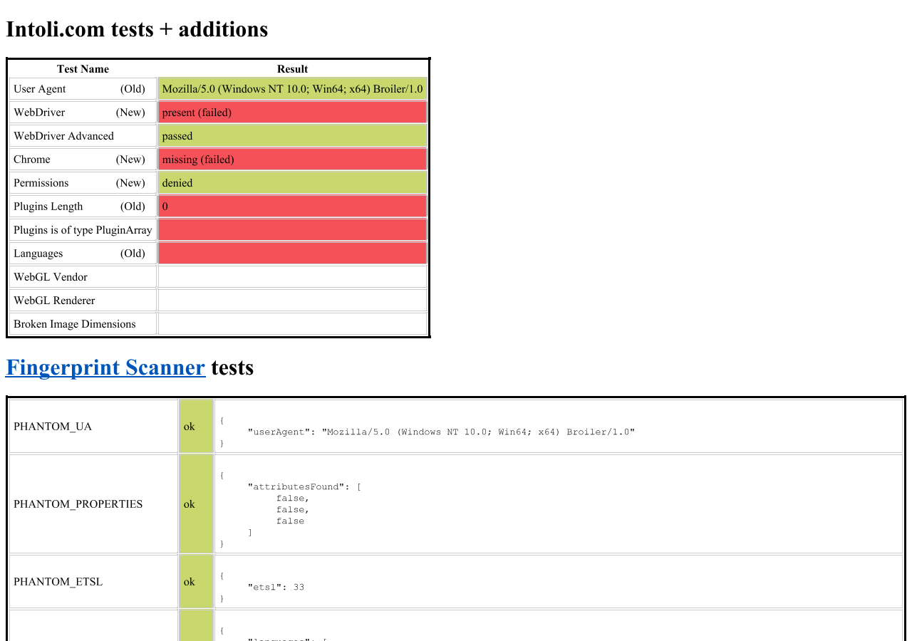

# Sannysoft first P1: image loading

Implemented on 2026-10-08 in `D:\Broiler.HtmlBridge`, starting from commit
`83e98dd8cdb4820e3953b386ffaafce71bdafeb7`. Changes are local and uncommitted.
This completes the first P1 in the [original investigation](sannysoft-investigation-2026-10-08.md).

## Outcome

The unmodified live [Sannysoft page](https://bot.sannysoft.com/) now completes its
fingerprint collector and populates **20 scanner rows**. The final CLI analysis
returned exit code 0 in 56.88 seconds at 1280×900. The screenshot and post-script
DOM were inspected; success was not inferred from the exit code alone.



The archived collector reproduction resolves all **33 collector fields** without
replacing `tpCanvas`. Its actual PNG loads at 1×1 and canvas readback returns
`[0,0,0,0]`, the expected transparent pixel. Separate regression tests use opaque
red, green and blue pixels to detect a fake or empty canvas implementation.
The live site's displayed fingerprint is a separate serialization of its results;
the typed-array value serializes as `{}` in that display, so pixel verification uses
`Array.from(...)` explicitly.

The committed platform fixture now reports:

```json
{
  "imageConstructor": {"event":"load","complete":true,"naturalWidth":1,"isElement":true},
  "imageElement": {"event":"load","complete":true,"naturalWidth":1}
}
```

## Implementation

The old JavaScript `Image` stub is replaced with a real detached DOM image element
sharing `HTMLImageElement.prototype`. The element owns its decoded pixels,
`complete`, intrinsic dimensions and queued `load`/`error` events. Setting `src`
through properties or attributes uses the same lifecycle. Replacing/removing the
source, disposing the session or navigating its frame suppresses stale callbacks;
frame callbacks run with their owning window context.

Data URLs, permitted local files and HTTP(S) resources use the existing decoder
and document request context. Network loads use the profile transport, cookie and
CORS handling, cancellation, resource trace and resource timing. Standalone
bridges use a private transport. Encoded images are limited to 32 MiB, and network
requests use the existing five-second fetch timeout.

The collector also required `CanvasRenderingContext2D.drawImage`, which was absent.
The fix adds its 3-, 5- and 9-argument forms for image/canvas sources, source cropping,
scaling, global alpha and self-copy handling. Cross-origin response taint propagates
to destination canvases; pixel reads and serialization throw `SecurityError` until
the canvas is resized. Explicit CSS zero dimensions are preserved when intrinsic
image dimensions are available.

Principal source files in the HtmlBridge checkout:

- `src/Broiler.HtmlBridge.Dom/DomBridge/Images.cs`
- `src/Broiler.HtmlBridge.Dom/Runtime/ResourceLoader.cs`
- `src/Broiler.HtmlBridge.Dom/Features/CanvasBinding.cs`
- `src/Broiler.HtmlBridge.Dom/DomBridge/CanvasRenderingContext2D.cs`
- `tests/Broiler.HtmlBridge.Tests/ImageLoadingTests.cs`

## Validation

| Check | Result |
| --- | --- |
| New image regression cases | 21 passed |
| Image cases plus existing dimension/culture cases | 42 passed |
| Full Release suite | 1,944 passed, 21 skipped, 0 failed |
| Full Release-VM configuration suite | 2,000 passed, 21 skipped, 0 failed |
| Engine-neutrality guard | Passed; all counts equal their budgets |
| Unmodified live page, final local CLI | 20 scanner rows and populated fingerprint details |
| Archived collector with real PNG | 33 fields; load event; 1×1; transparent pixel readback |
| Committed platform fixture | Constructor and DOM image both load successfully |

The new tests also cover invalid data and decoding, HTTP errors, denied CORS,
profile cookies, timing entries, source changes from load handlers, disposal,
frame navigation/context, taint propagation, and canvas reset. They inject a
session-local test decoder; the CLI runs validate real PNG decoding. The
Release-VM configuration expands the full suite with VM tests; the new image
tests themselves currently use the existing `ScriptEngine` test harness.

Run component validation from `D:\Broiler.HtmlBridge`:

```powershell
dotnet test Broiler.HtmlBridge.slnx -c Release
dotnet test Broiler.HtmlBridge.slnx -c Release-VM
& 'C:/Program Files/Git/bin/bash.exe' scripts/check-engine-neutrality.sh
```

Each configuration needs its own restore; an initial Release-VM attempt with
`--no-restore` reused Release assets and failed on missing VM references. Running
with restore resolved that setup issue and the full suite passed.

## Reproduce with Browser CLI

Browser still references NuGet HtmlBridge `0.1.0-preview.21`. A normal Browser build
does **not** pick up these sibling source changes. For local validation, copy the
CLI output into an isolated directory, then replace the four HtmlBridge DLLs there.
This leaves the NuGet cache and normal CLI output untouched.

Run from `D:\Broiler.Browser`:

```powershell
dotnet build src/Broiler.Browser.Cli/Broiler.Browser.Cli.csproj -c Release
if ($LASTEXITCODE -ne 0) { throw 'Browser CLI build failed' }
dotnet build ../Broiler.HtmlBridge/Broiler.HtmlBridge.slnx -c Release
if ($LASTEXITCODE -ne 0) { throw 'HtmlBridge build failed' }
$imageFixCli = Join-Path $PWD 'artifacts/sannysoft-image-fix-2026-10-08/cli'
New-Item -ItemType Directory -Force $imageFixCli | Out-Null
Copy-Item 'src/Broiler.Browser.Cli/bin/Release/net10.0/*' $imageFixCli -Recurse -Force
foreach ($part in @('Core', 'DomBridgeUtils', 'Dom', 'Scripting')) {
  Copy-Item "../Broiler.HtmlBridge/src/Broiler.HtmlBridge.$part/bin/Release/net10.0/Broiler.HtmlBridge.$part.dll" $imageFixCli -Force
}
dotnet "$imageFixCli/Broiler.Cli.dll" --analyze https://bot.sannysoft.com/ `
  --output-dir artifacts/sannysoft-image-fix-2026-10-08/recheck `
  --width 1280 --height 900 --analysis-timeout 120 --verbose
```

For normal distribution, publish a new HtmlBridge package and update Browser's
package reference. No package was published or dependency reference changed here.

## Remaining scope and evidence

This fixes the image wait and canvas operation needed by the collector. It does
not make Sannysoft fully pass: `PluginArray` still aborts the final main script,
`document.write()` still misplaces detail values, and `innerText` assignment still
does nothing. Unsupported media APIs and the other baseline P2/P3 issues remain.

The image implementation is not a complete HTML image stack: responsive `srcset`
selection, blob URLs, `decode()`, exhaustive markup-image scheduling and full CSP
image policy are outside this patch. Network fetching runs inside a queued host
task rather than concurrently. Canvas drawing uses the existing rasterizer and
does not add transforms or image-smoothing controls.

Local evidence is under `artifacts/sannysoft-image-fix-2026-10-08/`: `final-live/`
contains the final analysis, DOM and screenshots; `collector.json` and
`platform.json` preserve reduced checks. HtmlBridge's `artifacts/image-*.log` and
`tests/Broiler.HtmlBridge.Tests/TestResults/image-fix-*.trx` preserve test results.
These artifact directories are ignored by Git. The screenshot in this document
and [compact validation snapshot](repros/sannysoft-image-fix-observed-2026-10-08.json)
are retained with the report.
