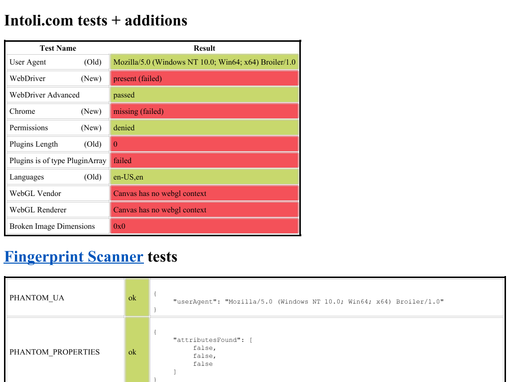

# Sannysoft fourth P1: HTMLElement.prototype.innerText setter

Implemented on 2026-10-08 in `D:\Broiler.HtmlBridge`.
This completes the fourth P1 in the [original investigation](sannysoft-investigation-2026-10-08.md).

## Outcome

Previously:
1. In `D:\Broiler.HtmlBridge\src\Broiler.HtmlBridge.Dom\Features\ElementContentBinding.cs:88–89`, `innerText` and `outerText` were registered on `HTMLElement.prototype` with a `null` setter:
   ```csharp
   realm.DefineAccessor(target, "innerText",
       (in call) => JsValue.String(element(in call, "innerText").TextContent), null);
   ```
2. Any assignment to `element.innerText = value` silently did nothing in JavaScript.
3. On [bot.sannysoft.com](https://bot.sannysoft.com/), after `inline-30` completed its tests, the table cell for `Plugins is of type PluginArray` (`<td id="plugins-type-result">`) was assigned via `pluginsTypeElement.innerText = "failed"` (or `"passed"`). Because the setter was absent, the cell remained completely blank.
4. In the reduced platform fixture (`docs/repros/sannysoft-platform-probes.html`), `document.getElementById('inner-text-target').innerText = 'INNER_TEXT_VALUE'` left `textContent` empty (`""`).

With this fix:
1. `HTMLElement.prototype.innerText` and `HTMLElement.prototype.outerText` setters are implemented per WHATWG HTML §3.2.6.2.
2. Setting `innerText`:
   - Arguments undergo Web IDL `[LegacyNullToEmptyString]` coercion: `null` is converted to `""`, `undefined` to `"undefined"`, and other types to strings via standard ECMAScript conversion.
   - Clears existing children recursively, freeing object wrapper bindings.
   - Parses the input into a rendered text fragment:
     - Line breaks (`\r\n`, `\n`, `\r`) produce `<br>` elements.
     - Text segments between line breaks produce `Text` nodes.
   - Appends the fragment children to the element (or `<template>`'s contents fragment).
   - Resets computed style engines and invalidates the element's style scope.
3. Setting `outerText`:
   - Throws `NoModificationAllowedError` `DOMException` if the element has no parent.
   - Replaces the element within its parent with the rendered text fragment (or empty text node if string was empty).
   - Merges adjacent text nodes at the replacement boundary per WHATWG specification.
   - Resets computed style engines and invalidates the parent's style scope.
4. In `docs/repros/sannysoft-platform-probes.html`:
   - `innerTextAfterAssignment` becomes `"INNER_TEXT_VALUE"` (previously `""`).
   - `<div id="inner-text-target">` contains `"INNER_TEXT_VALUE"`.
5. On the live [Sannysoft page](https://bot.sannysoft.com/):
   - The cell `Plugins is of type PluginArray` now visibly displays `"failed"` (due to zero plugins length) in `<td id="plugins-type-result" class="failed result">failed</td>`.



## Implementation

Principal source files in `D:\Broiler.HtmlBridge`:
- `src/Broiler.HtmlBridge.Dom/Features/IElementContentHost.cs`:
  - Added `void SetElementInnerText(DomElement element, string text);`
  - Added `void SetElementOuterText(DomElement element, string text);`
- `src/Broiler.HtmlBridge.Dom/DomBridge/Hosts.Nodes.cs`:
  - Implemented `IElementContentHost.SetElementInnerText` and `IElementContentHost.SetElementOuterText`.
- `src/Broiler.HtmlBridge.Dom/DomBridge/Traversal.cs`:
  - Implemented `SetElementInnerText(DomElement element, string text)`:
    - Resolves target container (including `element.TemplateContents` for `<template>`).
    - Cleans existing child subtree through `RemoveElementsRecursive` and `ClearChildren`.
    - Builds rendered text fragment using `BuildRenderedTextFragment` with owning document (`GetOwningDocument`).
    - Appends fragment children to target.
    - Calls `ResetComputedStyleEngines()` and `InvalidateStyleScope(element)`.
  - Implemented `SetElementOuterText(DomElement element, string text)`:
    - Resolves parent and child index.
    - Replaces element with fragment children (or empty text node).
    - Merges adjacent text nodes via `MergeWithNextTextNode` (`text.AppendData(nextText.Data)`).
    - Invalidates style scope on parent.
  - Implemented `BuildRenderedTextFragment(DomDocument document, string input)`:
    - Collects non-CR/LF code point runs into `document.CreateTextNode(chunk)`.
    - Consumes CRLF (`\r\n`), lone CR (`\r`), and LF (`\n`) runs into `document.CreateElementNS(DomNamespaces.Html, "br")`.
- `src/Broiler.HtmlBridge.Dom/Features/ElementContentBinding.cs`:
  - Updated `InstallHtmlElementMembers(IElementContentHost host, IJsRealm realm, JsValue target, JsElementSource element)`:
    - Wires `innerText` accessor to `SetInnerText`.
    - Wires `outerText` accessor to `SetOuterText`.
  - Implemented `SetInnerText` and `SetOuterText` with `LegacyNullToEmptyStringArgument`:
    - Handles `[LegacyNullToEmptyString]` attribute (`null` -> `""`).
- `src/Broiler.HtmlBridge.Dom/DomBridge/ElementInterface.cs`:
  - Updated caller line 445: `Dom.Features.ElementContentBinding.InstallHtmlElementMembers(this, Realm, target, element);`.
- `tests/Broiler.HtmlBridge.Tests/InnerTextBindingTests.cs`:
  - 13 unit tests covering simple strings, empty strings, null values, undefined values, numbers, booleans, single newlines, CRLF/CR/LF combinations, consecutive newlines, boundary newlines, detached elements, outerText replacement, outerText detached throw, and outerText with newlines.

## Validation

| Check | Result |
| --- | --- |
| `InnerTextBindingTests` | 13 passed, 0 failed |
| Full Release suite | 1,998 passed, 21 skipped, 0 failed |
| Full Release-VM configuration suite | 2,054 passed, 21 skipped, 0 failed |
| Engine-neutrality guard | Passed; 0 violations across 5 projects / 342 source files |
| Platform probes fixture (`sannysoft-platform-probes.html`) | `innerTextAfterAssignment: "INNER_TEXT_VALUE"` |
| Live page (`https://bot.sannysoft.com/`) | `plugins-type-result` cell populated with `"failed"` |
