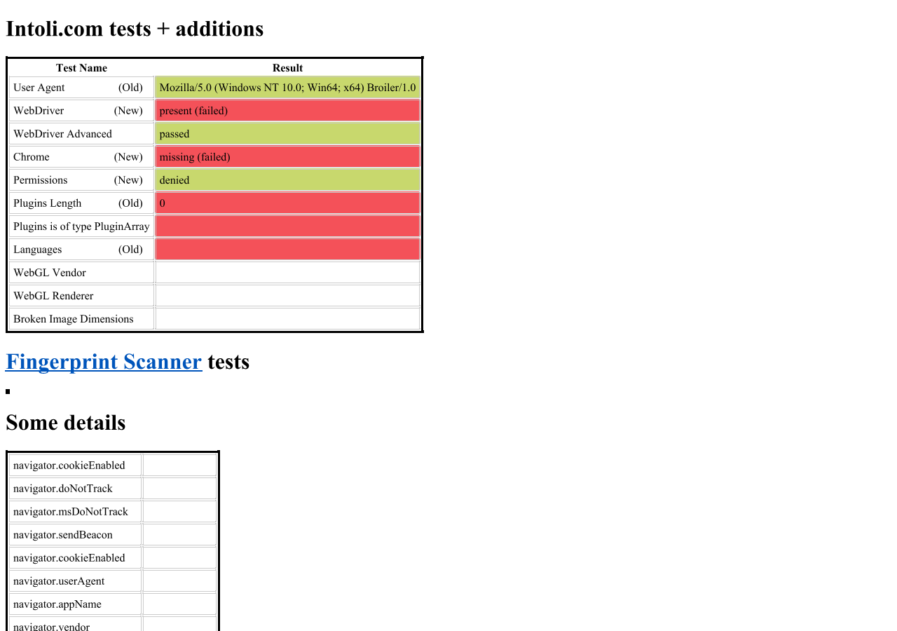

# Sannysoft rendering investigation and repair plan

Measured on **2026-10-08**, starting at **17:03 Europe/Berlin**, against
[bot.sannysoft.com](https://bot.sannysoft.com/).
**Status: all four P1 items implemented and verified in the local HtmlBridge checkout;
remaining P2/P3 repairs proposed. Browser's published package reference is unchanged.**

The investigation below preserves the original baseline. The first P1 follow-up
is recorded in [the image-loading fix and validation notes](sannysoft-image-fix-2026-10-08.md),
the second P1 follow-up is recorded in [the PluginArray fix and validation notes](sannysoft-plugin-fix-2026-10-08.md),
the third P1 follow-up is recorded in [the document.write fix and validation notes](sannysoft-write-fix-2026-10-08.md),
and the fourth P1 follow-up is recorded in [the innerText fix and validation notes](sannysoft-innertext-fix-2026-10-08.md).
With the patched local assemblies, the unmodified live page populates its
fingerprint details, all 20 scanner rows, all detail table cells in-place,
and displays test result text for `PluginArray` type validation.

Broiler fetches and renders the page, but several result sections remain empty.
Both `--analyze` and `--capture-image` exit successfully; that means the commands
completed, not that the page's tests completed. The principal causes are a missing
`PluginArray` interface, an inert `Image` constructor, and incorrect
`document.write()` placement. A controlled replay also reveals a missing
`innerText` setter. The CLI separately runs scripts at the wrong viewport size.



## Environment and reproduction

Browser commit: `d3596ac50936cf21ca7fb9d5f6831d8c03b61513`.
Windows x64, OS build 26200, .NET SDK 10.0.401, runtime 10.0.12, Release configuration.
The CLI build succeeded with zero warnings and zero errors.

| Component | Restored version |
| --- | --- |
| Broiler.HtmlBridge | 0.1.0-preview.21 |
| Broiler.JavaScript | 0.1.0-preview.6 |
| Broiler.HTML | 0.1.0-preview.25 |
| Broiler.Layout | 0.1.0-preview.21 |
| Broiler.CSS | 0.1.0-preview.16 |
| Broiler.DOM | 0.1.0-preview.14 |
| Broiler.Graphics | 0.1.0-preview.11 |

Full assembly versions, content hashes and reduced-probe results are preserved in
[the observed-results snapshot](repros/sannysoft-observed-2026-10-08.json).
These runs used the Browser project's restored packages, not sibling checkouts.
Source inspection used the sibling HtmlBridge checkout at
`83e98dd8cdb4820e3953b386ffaafce71bdafeb7`; its source explains the observed behavior,
but that checkout is not the exact package build (`707ff016...`).

Run these PowerShell commands from the repository root:

```powershell
dotnet build src/Broiler.Browser.Cli/Broiler.Browser.Cli.csproj -c Release
$cli = 'src/Broiler.Browser.Cli/bin/Release/net10.0/Broiler.Cli.dll'
dotnet $cli --analyze https://bot.sannysoft.com/ `
  --output-dir artifacts/sannysoft-2026-10-08/live `
  --width 1280 --height 900 --analysis-timeout 180 --verbose
dotnet $cli --capture-image https://bot.sannysoft.com/ `
  --output artifacts/sannysoft-2026-10-08/capture.png `
  --width 1280 --height 900 `
  --diagnostic-dir artifacts/sannysoft-2026-10-08/capture-diagnostics
```

Both commands returned **0**. The live analysis took **39.57 seconds**, including
a separate BrowserApp window-path run. The document and all six initial script
dependencies returned HTTP 200. The analysis recorded four distinct failures:

| Failure | Effect |
| --- | --- |
| `inline-16`: `undefined is not a function` | The site's legacy `navigator.getUserMedia()` call fails. |
| `inline-30`: `PluginArray is not defined` | The large final script aborts partway through. |
| Unhandled rejection reading `navigator.mediaDevices.enumerateDevices` | The media-device detail remains empty. |
| Yandex `tag.js` request canceled after 15.02 s | Analytics delays settling; unrelated to the main test dependencies. |

The raw diagnostic log includes the repeated script failures from the window run;
the four-failure report above describes the primary analysis. The later normal
capture reported three failures, without the analytics fetch failure.

## Repair priorities

| Priority | Problem | Owner | Completion criterion |
| --- | --- | --- | --- |
| P1 — locally fixed | `new Image()` never loads or errors | HtmlBridge; HTML/Media integration | Verified: the collector's image promise settles and the fingerprint/scanner sections populate. |
| P1 — locally fixed | Missing `PluginArray` interface | HtmlBridge | Verified: `instanceof PluginArray` executes without throwing, empty list semantics hold, and final script completes. |
| P1 — locally fixed | Nested `document.write()` escapes its table cell | HtmlBridge | Verified: each detail value is inserted at its executing script's position; no accumulation at body end. |
| P1 — locally fixed | `innerText` assignment does nothing | HtmlBridge | Verified: Plugin-type result text appears ("failed"); generic element assignment updates the DOM per WHATWG HTML §3.2.6.2. |
| P2 — locally fixed | Script viewport ignores CLI dimensions | Browser CLI | Verified: initial scripts, media queries, geometry and rendering agree on requested viewport (1280×900, 800×600). |
| P2 — locally fixed | `screen` lacks interface/prototype accessors | HtmlBridge | Screen descriptor probes return the appropriate accessor instead of `undefined`. |
| P2 — locally fixed | Image element events/metadata are incomplete | HtmlBridge; HTML/Media integration | Verified: element and constructor share lifecycle, 404/broken dispatch errors, metadata updates, and unstyled broken dimensions report 0x0. |
| P3 | Unsupported media/WebGL APIs and ignored wrapping | HtmlBridge, media/graphics, Layout | Explicit capability scope and independent compatibility tests. |

P1 here means blocking meaningful page output, not a crash or security severity.

## 1. The fingerprint promise waits for an image event that never arrives

The fetched `fpCollect.min.js` is readable source despite its name. Its `tpCanvas`
probe creates `new Image()`, assigns a 1×1 PNG data URL, and resolves only from
`onload` or `onerror`. `generateFingerprint()` waits for this and three other
asynchronous attributes through `Promise.all`.

In a local diagnostic copy, the collector's function map was exposed for inspection.
`multimediaDevices`, `permissions` and `accelerometerUsed` all fulfilled.
`tpCanvas` and the whole fingerprint remained pending after the timer fired.
An independent `new Image()` probe reported `complete: false`, `naturalWidth: 0`,
and no event. Replacing only `tpCanvas` through the collector's own
`addCustomFunction` hook with a resolved diagnostic value let all **33 fields** resolve.
This isolates the blocker from media-device absence and analytics networking.

Source: HtmlBridge
`src/Broiler.HtmlBridge.Dom/Polyfills/content-rendering-polyfills.js:16` declares
`Image` as a plain JavaScript object. Its `src` is a regular property and its
event-listener methods do nothing. The reduced probe also reports that the object
is not an `HTMLImageElement`.

Implement `Image()` through the real image-element machinery, including detached
image loading, data URLs, decoding, intrinsic dimensions and queued load/error
events. Connect that work to the page lifecycle and resource accounting. A renderer
being able to paint an image does not fulfill the JavaScript image lifecycle.
The [HTML Image constructor requirements](https://html.spec.whatwg.org/multipage/embedded-content.html#dom-image)
provide the implementation contract.

Acceptance: a valid detached 1×1 image loads, a malformed image errors, `complete`
and intrinsic dimensions update, event listeners work, and drawing the loaded
image into a canvas makes its pixel data available. Test source changes and
disposal too. Then run the unmodified collector without any diagnostic bypass.

## 2. Missing PluginArray aborts the remainder of the final script

The failure occurs at line 154 of the archived `inline-30` script:

```javascript
navigator.plugins instanceof PluginArray
```

`navigator.plugins` exists, has length zero, and has the tag `[object Object]`;
the global `PluginArray` is undefined. HtmlBridge's
`Features/NavigatorCapabilityBinding.cs:77` builds the collection with
`realm.NewObject()` and adds length/item/namedItem/refresh, without its interface.

Consequently the page never reaches Languages, either WebGL result, the broken
image test, or the five canvas drawings. Their blank cells are not evidence that
each individual feature failed. A local replay that substitutes `false` for just
the `instanceof` expression reaches these later checks: Languages becomes
`en-US,en`, WebGL reports no context, and all five canvas sections acquire a canvas
and a hash. Canvas pixel fidelity was not established by that experiment.

Implement the interface object, prototype, brand and collection semantics for
PluginArray and the corresponding MimeTypeArray surface. Preserve truthful empty
collections when there is no PDF/plugin support. The site's condition also rejects
length zero, so its plugin row can legitimately remain red after this fix.
Use the [HTML plugin interface definitions](https://html.spec.whatwg.org/multipage/system-state.html#dom-navigator-plugins).

Acceptance: interface/brand tests, empty-list item and named-item behavior, and
completion of the final script. Do not manufacture installed plugins to turn the
site's heuristic green.

## 3. document.write inserts values at the end of body

The live post-script document ends with concatenated detail values beginning
`trueundefinedundefinedfalsetrueMozilla/5.0...`, while the corresponding table
cells are empty. The reduced fixture writes a span from a script inside a `td`;
the resulting span's parent is `BODY`, not the cell.

In `Features/DocumentWriteBinding.cs:51–56`, the bridge discards the current script
unless its immediate parent is the body. Nested scripts therefore fall through to
the append-to-body path. This directly accounts for the site's detail table.

Preserve the parser insertion point for nested scripts and parse written fragments
in the appropriate context. Using the script's actual parent is a starting point;
correct parser behavior, stable script identity and insertion order must survive
multiple writes and intervening DOM mutations.

Acceptance: a script in a table cell writes into that cell, consecutive writes keep
their order, sibling cells stay unchanged, and no values accumulate after the page.

## 4. innerText has a getter but no setter

After bypassing the PluginArray exception, the plugin-type cell is still empty even
though the page assigns `pluginsTypeElement.innerText = "failed"`.
The independent fixture assigns `INNER_TEXT_VALUE` to a div and reads back empty
`textContent`; the serialized div also remains empty.

`Features/ElementContentBinding.cs:88–89` registers `innerText` with a null setter.
Implement the [HTML innerText setter](https://html.spec.whatwg.org/multipage/dom.html#the-innertext-idl-attribute),
including line-break handling and normal mutation/render invalidation.

Acceptance: assignments replace children, empty strings clear them, line breaks
produce the specified DOM, and the plugin-type result visibly says `failed` or
`passed` according to the actual collection.

## 5. CLI scripts see 1024×768 when rendering at 1280×900

The reduced fixture reports `innerWidth/innerHeight = 1024/768` in the analysis,
despite a 1280×900 screenshot. Its separate BrowserApp window-path screenshot
reports 1280×900. The same discrepancy affects the recorded `screen` dimensions.

`HeadlessBrowser` constructs `BrowserApp.BridgeOptions` without the available
viewport callback. `PageAnalyzer` passes dimensions to rendering, but not into
that initial script environment. The window's `LoadUrlOnWorkerAsync` does pass
`viewport: () => ViewportOf(progress)`.

Thread viewport dimensions through the headless session options before script
execution, for both analysis and image capture. Setting the viewport only after
initial scripts run is too late for fingerprinting and responsive initialization.

Acceptance: test at 1280×900 and another non-default size; initial script values,
`matchMedia`, layout queries and screenshots agree. Keep screen geometry a defined
host contract rather than assuming every desktop window equals the physical screen.

The analyzer's coarse window comparison reported **0.00% difference even on the
reduced fixture with these different numbers**. It is useful for large visual
changes, but must not be used to establish DOM or API equivalence.

> **Resolution (2026-10-08)**: Completed and verified in `src/Broiler.Browser.Cli`. `HeadlessBrowserOptions` now accepts `Viewport` and forwards it to `BrowserApp.BridgeOptions`. `PageAnalyzer`, `CaptureService`, and CLI dispatch now configure viewport dimensions for analysis, image captures, and evaluation runs before scripts execute. Full details in [`docs/sannysoft-viewport-fix-2026-10-08.md`](sannysoft-viewport-fix-2026-10-08.md).

## 6. Screen descriptors and image element lifecycle need follow-up

The collector explicitly inspects the getter for `width` on `screen`'s prototype.
It catches an exception and records `error`, because that descriptor is undefined.
`DomBridge/Registration/Window.cs:482` creates a plain object with own numeric
properties. Implement the Screen interface and its attribute accessors using a
consistent host source; verify descriptors and receiver checks independently of
the CLI viewport repair. This caught exception does not block the collector.

> **Resolution (2026-10-08)**: Completed and verified in `d:\Broiler.HtmlBridge`. `Screen` and `ScreenOrientation` interface objects and prototypes are now exposed on `window` and `globalThis`. `window.screen` is an instance of `Screen` with no own properties, all 9 CSSOM View attributes (`width`, `height`, `availWidth`, `availHeight`, `availLeft`, `availTop`, `colorDepth`, `pixelDepth`, `orientation`) are accessors on `Screen.prototype` with Web IDL receiver checks (`Illegal invocation`), and values are read dynamically from `IScreenHost`. Full details in [`docs/sannysoft-screen-fix-2026-10-08.md`](sannysoft-screen-fix-2026-10-08.md).


A separate `document.createElement('img')` probe, appended to the body with the
same data URL, also receives no event during settling. Its `complete` and
`naturalWidth` properties are undefined (therefore omitted by JSON serialization).
The local bypass replay leaves the broken-image result blank after reaching it.
That replay's remote nonexistent-image requests failed at the transport level, so
it does not establish the correct broken-image dimensions. Use deterministic
successful/404 fixture responses to validate event dispatch and sizing after the
common image lifecycle is implemented.

> **Resolution (2026-10-08)**: Completed and verified in `d:\Broiler.HtmlBridge`. `document.createElement('img')` and `new Image()` share the same underlying `HTMLImageElement` lifecycle. In addition to successful data/HTTP loads, deterministic 404 responses, invalid data URLs, and network failures dispatch `error` events (calling `.onerror` and `addEventListener('error')`), set `complete = true`, set `naturalWidth = 0` / `naturalHeight = 0`, and report `width = 0` / `height = 0` for unstyled broken images (matching modern Chromium layout behavior for broken images without attributes/CSS) while preserving explicit HTML attributes and CSS styles. Validated through 32 tests in `Broiler.HtmlBridge.Tests.ImageLoadingTests`, updated `docs/repros/sannysoft-platform-probes.html` (`brokenImageElement` reporting `event: "error"`, `dimensions: "0x0"`, `complete: true`), and CLI headless analysis. Full details in [`docs/sannysoft-image-lifecycle-fix-2026-10-08.md`](sannysoft-image-lifecycle-fix-2026-10-08.md).

## Other findings and expected outcomes

- `navigator.getUserMedia()` is a legacy API absent here. The live page calls it
  without feature detection. `navigator.mediaDevices` is also absent and its
  unconditional enumeration produces an unhandled rejection. Record these as
  media capability gaps; design modern MediaDevices support with the media/permission
  model before deciding whether to expose the legacy alias. Neither absence is the
  fingerprint collector's blocking promise: its own media probe handles absence.
- WebGL context creation returns null. In the bypass replay the site displays its
  existing no-context fallback. Real WebGL support is a separate graphics project;
  inventing vendor strings would not implement it.
- The live analyzer reports `word-wrap: break-word` ignored on six elements, with
  no CSS parse errors or unknown property names. Investigate alias handling in
  Broiler.Layout with a narrow table and a long unbroken value. The original page
  did not show measured horizontal overflow, so this is a reported support gap,
  not a proven cause of the empty sections.
- The primary analysis's Yandex script request timed out, while the window run
  fetched it successfully. The later normal capture also completed without that
  fetch failure. Treat the 15-second delay as an observed intermittent external
  request, not evidence of a failure to reach Sannysoft. Retain timing and
  cancellation evidence before changing network behavior.
- The collector deliberately generates invalid identifiers, invalid WebSocket
  construction and deep recursion; jQuery also catches feature-probe exceptions.
  First-chance exceptions are not all unhandled page errors. The optional
  `Broiler.JavaScript.Clr` assembly lookup also threw, but the scripts continued;
  this investigation found no causal link from it to the empty results.
- Broiler reports its own user agent, `webdriver: true`, no Chrome object, no
  plugins and denied notification permissions. These values explain some red rows.
  Completing the page means all supported checks execute and unsupported features
  report coherently; it does not mean passing every Chrome-oriented bot heuristic.

## Validation sequence

1. Implement the HtmlBridge interface, text and image-lifecycle repairs with
   focused component tests, then publish/update the Browser package references.
2. Wire the CLI viewport before scripts execute and add a non-default-viewport
   regression test across analysis and capture.
3. Run the committed [reduced fixture](repros/sannysoft-platform-probes.html):

   ```powershell
   $fixture = ([System.Uri](Resolve-Path docs/repros/sannysoft-platform-probes.html).Path).AbsoluteUri
   dotnet $cli --analyze $fixture --width 1280 --height 900 `
     --output-dir artifacts/sannysoft-platform-check --analysis-timeout 60
   ```

   Inspect its serialized JSON and both screenshots. Expected key changes are
   `writeParent: "write-cell"`, `innerTextAfterAssignment: "INNER_TEXT_VALUE"`,
   a real PluginArray interface, image completion/events, and viewport 1280×900.
4. Run the unmodified live page again with both commands. Require nonempty
   fingerprint output, scanner rows, completed final-script execution, correctly
   placed details, and explicit results/fallbacks for later checks. Compare the
   canvas pixels separately; identical reported hashes alone are insufficient.

The fixture is a diagnostic reproduction, not an assertion-based automated test.
Its 500 ms timer was observed to fire in the recorded runs. The initial investigation
changed no production code; the first P1 has since been implemented and validated
as detailed in the follow-up. No reference Chromium render was
captured; conclusions use Broiler output, reduced experiments, source inspection
and the cited interface contracts.

## Evidence retained locally

`artifacts/sannysoft-2026-10-08/` contains the build log, both live command logs and
exit codes, normal capture, complete `live/` analysis bundle, `capture-diagnostics/`,
the final `platform-probes-final/` bundle, collector-isolation experiments in
`probes/`, and the `bypass/` replay analysis. The replay removed analytics, loaded
the six archived dependencies locally, bypassed only the PluginArray expression
and tpCanvas wait, and used a file origin. It is causal evidence, not a fixed-site
or equivalent-origin result.

The artifacts directory is git-ignored. This document, the representative screenshot,
the self-contained fixture and the small observed-results snapshot are the durable
repository deliverables; preserve or copy the artifact bundle separately if sharing
all raw evidence. The live document and collector SHA-256 hashes are in the snapshot
so future runs can distinguish site changes from engine changes.
