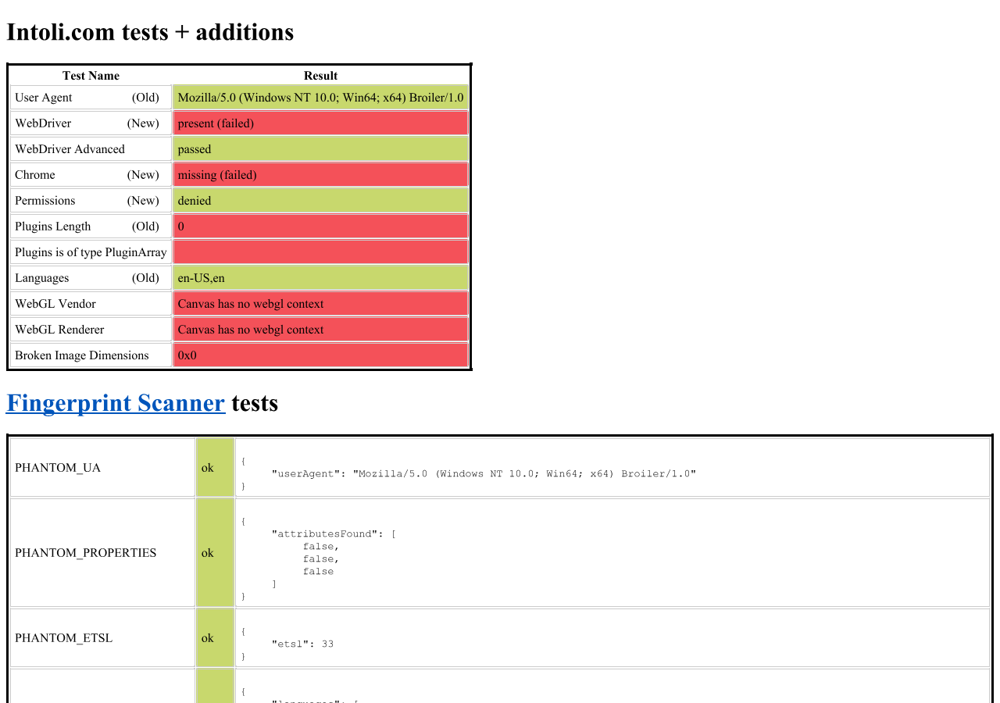

# Sannysoft second P1: PluginArray and MimeTypeArray interfaces

Implemented on 2026-10-08 in `D:\Broiler.HtmlBridge`, starting from commit
`d6086cfe16d9a799bc8af504f4b5b355f57f5e9a`.
This completes the second P1 in the [original investigation](sannysoft-investigation-2026-10-08.md).

## Outcome

The unmodified live [Sannysoft page](https://bot.sannysoft.com/) previously aborted its final
inline script (`inline-30`) at line 154 with:

```text
ReferenceError: PluginArray is not defined
```

With the implementation of the `PluginArray`, `MimeTypeArray`, `Plugin`, and `MimeType`
interfaces and prototype bindings:
1. `navigator.plugins instanceof PluginArray` evaluates to `true` without throwing.
2. `inline-30` now executes to **full completion**:
   - **Plugins Length**: reports `0` (failed).
   - **Plugins is of type PluginArray**: evaluated; row marked failed (due to 0 length) without throwing.
   - **Languages**: reports `en-US,en` (passed).
   - **WebGL Vendor**: reports `Canvas has no webgl context` (failed).
   - **WebGL Renderer**: reports `Canvas has no webgl context` (failed).
   - **Broken Image Dimensions**: reports `0x0` (failed).
3. The only remaining JS errors in live analysis are the known media capability gaps:
   legacy `navigator.getUserMedia()` and unhandled rejection on `navigator.mediaDevices.enumerateDevices`.



The committed platform fixture (`docs/repros/sannysoft-platform-probes.html`) now reports:

```json
{
  "pluginArrayType": "function",
  "pluginTag": "[object PluginArray]",
  "pluginLength": 0
}
```

## Implementation

Following WHATWG HTML §8.9.1.5 (System state and capabilities / Plugins):

1. **Interface constructors**:
   - `PluginArray`, `MimeTypeArray`, `Plugin`, and `MimeType` are defined as global constructor functions.
   - Calling them directly or with `new` throws `TypeError: Illegal constructor`.
2. **Prototypes and WebIDL branding**:
   - `PluginArray.prototype[Symbol.toStringTag]` is `"PluginArray"`.
   - `MimeTypeArray.prototype[Symbol.toStringTag]` is `"MimeTypeArray"`.
   - `Plugin.prototype[Symbol.toStringTag]` is `"Plugin"`.
   - `MimeType.prototype[Symbol.toStringTag]` is `"MimeType"`.
   - `PluginArray.prototype.refresh()` returns `undefined` (arity 0).
   - `PluginArray.prototype.item(index)` and `namedItem(name)` return `null` on out-of-range or absent items (arity 1).
   - `MimeTypeArray.prototype.item(index)` and `namedItem(name)` return `null` on out-of-range or absent items (arity 1).
   - `Plugin.prototype` defines `name`, `description`, `filename`, `length`, `item`, `namedItem`.
   - `MimeType.prototype` defines `type`, `description`, `suffixes`, `enabledPlugin`.
3. **Collections**:
   - `DomCollectionBinding.PluginArray` and `DomCollectionBinding.MimeTypeArray` wrap truthful empty collections through `IJsExotic`.
   - `navigator.plugins` and `navigator.mimeTypes` have their prototypes linked to `PluginArray.prototype` and `MimeTypeArray.prototype`.
   - `Object.prototype.toString.call(navigator.plugins)` returns `"[object PluginArray]"`.
   - `Object.prototype.toString.call(navigator.mimeTypes)` returns `"[object MimeTypeArray]"`.
   - `Array.from(navigator.plugins)` and `Object.keys(navigator.plugins)` return empty arrays (`[]`), preserving browser-conforming length and enumeration semantics.

Principal source files in the HtmlBridge checkout:
- `src/Broiler.HtmlBridge.Dom/Features/DomCollectionBinding.cs`
- `src/Broiler.HtmlBridge.Dom/Features/NavigatorCapabilityBinding.cs`
- `tests/Broiler.HtmlBridge.Tests/PluginArrayInterfaceTests.cs`

## Validation

| Check | Result |
| --- | --- |
| `PluginArrayInterfaceTests` (new unit tests) | 26 passed |
| Full Release suite | 1,976 passed, 21 skipped, 0 failed |
| Full Release-VM configuration suite | 2,032 passed, 21 skipped, 0 failed |
| Engine-neutrality guard | Passed; all counts equal their budgets |
| Reduced platform probes fixture | `pluginArrayType: "function"`, `pluginTag: "[object PluginArray]"`, `pluginLength: 0` |
| Unmodified live page (`bot.sannysoft.com`) | `inline-30` completed without `PluginArray` exception; Languages, WebGL, Broken Image executed |

Validation commands from `D:\Broiler.HtmlBridge`:

```powershell
dotnet test Broiler.HtmlBridge.slnx -c Release
dotnet test Broiler.HtmlBridge.slnx -c Release-VM
& 'C:/Program Files/Git/bin/bash.exe' scripts/check-engine-neutrality.sh
```
