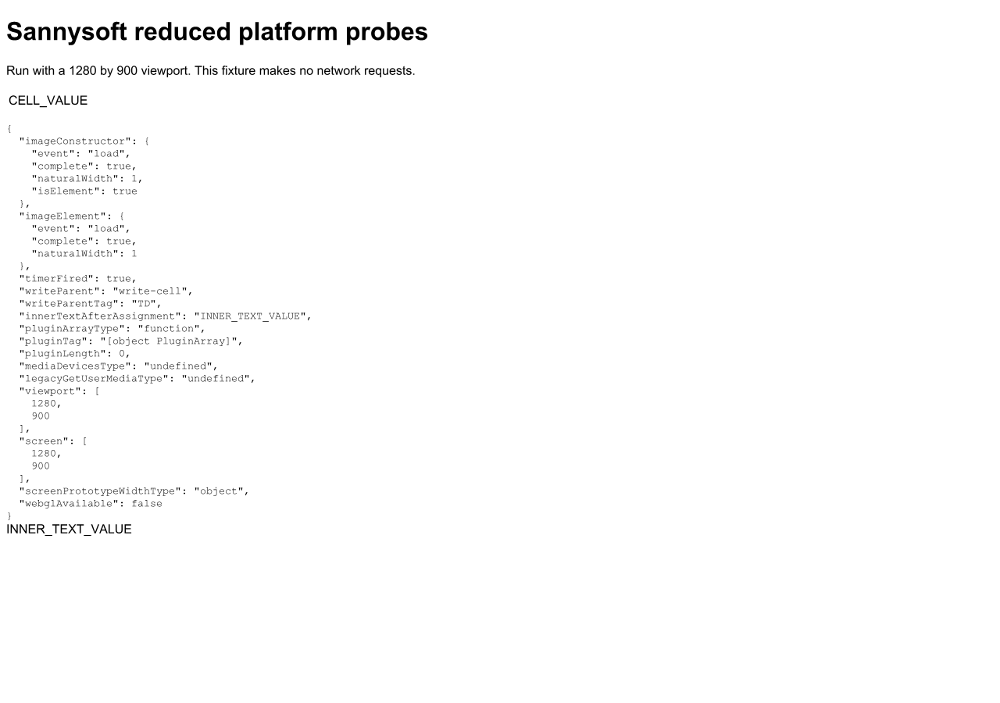

# Sannysoft second P2: Screen interface, prototype accessors, and receiver checks

Implemented on 2026-10-08 in `D:\Broiler.HtmlBridge`.
This completes the second P2 item (Problem 6) in the [investigation plan](sannysoft-investigation-2026-10-08.md).

## Outcome

### Background & Problem Statement

On [bot.sannysoft.com](https://bot.sannysoft.com/), `fpCollect.min.js:212` inspects the `Screen` prototype descriptor for `width`:

```javascript
Object.getOwnPropertyDescriptor(Object.getPrototypeOf(screen), "width").get.toString()
```

Previously:
1. `screen` was minted as a plain JavaScript object via `realm.NewObject()` in `src/Broiler.HtmlBridge.Dom/DomBridge/Registration/Window.cs:482` with own numeric properties (`width`, `height`, etc.).
2. The `Screen` interface constructor global (`window.Screen` / `globalThis.Screen`) did not exist.
3. `Screen.prototype` did not exist; `Object.getPrototypeOf(screen)` evaluated to `Object.prototype`.
4. `Object.getOwnPropertyDescriptor(Object.prototype, "width")` returned `undefined`.
5. Accessing `.get` on `undefined` threw an unhandled `TypeError: Cannot read property 'get' of undefined`.
6. In `docs/repros/sannysoft-platform-probes.html`:
   ```javascript
   probeResults.screenPrototypeWidthType = typeof Object.getOwnPropertyDescriptor(Object.getPrototypeOf(screen), 'width');
   ```
   reported `"undefined"` instead of `"object"`.

### Result After Fix

1. The `Screen` and `ScreenOrientation` interface constructors and prototypes are registered on `window` and `globalThis`.
2. Calling `Screen()` or `new Screen()` throws `TypeError: Illegal constructor`.
3. Calling `ScreenOrientation()` or `new ScreenOrientation()` throws `TypeError: Illegal constructor`.
4. `window.screen` is an instance of `Screen`:
   - `screen instanceof Screen === true`
   - `Object.getPrototypeOf(screen) === Screen.prototype`
   - `Object.prototype.toString.call(screen) === "[object Screen]"`
5. `window.screen` has **no own properties** (`Object.getOwnPropertyNames(screen).length === 0`).
6. All CSSOM View §4 attributes (`width`, `height`, `availWidth`, `availHeight`, `availLeft`, `availTop`, `colorDepth`, `pixelDepth`, `orientation`) are accessor properties on `Screen.prototype` (`{ get, set: undefined, enumerable: true, configurable: true }`).
7. Getters on `Screen.prototype` enforce Web IDL receiver checks: calling any getter with an incompatible receiver (`{}` or `null` or `window`) throws `TypeError: Failed to read the '<name>' property from 'Screen': Illegal invocation`.
8. Dimensions are read dynamically from the host (`IScreenHost`), maintaining live agreement between viewport and screen.
9. `screen.orientation` returns a `ScreenOrientation` instance (`[SameObject]`) whose `type` dynamically reflects the screen's aspect ratio (`"landscape-primary"` vs `"portrait-primary"`).
10. In the platform probes fixture (`docs/repros/sannysoft-platform-probes.html`), `probeResults.screenPrototypeWidthType` now evaluates to `"object"`.
11. Line 212 of `fpCollect.min.js` (`Object.getOwnPropertyDescriptor(Object.getPrototypeOf(screen), "width").get.toString()`) executes without throwing.



## Implementation Details

### 1. `IScreenHost` contract (`src/Broiler.HtmlBridge.Dom/Features/IScreenHost.cs`)

Defines the host interface decoupling screen geometry from concrete engine or bridge internals:

```csharp
internal interface IScreenHost
{
    int ScreenWidth { get; }
    int ScreenHeight { get; }
    int ScreenAvailWidth => ScreenWidth;
    int ScreenAvailHeight => ScreenHeight;
    int ScreenAvailLeft => 0;
    int ScreenAvailTop => 0;
    int ScreenColorDepth => 24;
    int ScreenPixelDepth => 24;
}
```

Implemented explicitly on `DomBridge` in `src/Broiler.HtmlBridge.Dom/DomBridge/Hosts.Window.cs`:
```csharp
public sealed partial class DomBridge : Dom.Features.IScreenHost
{
    int Dom.Features.IScreenHost.ScreenWidth => _viewportWidth;
    int Dom.Features.IScreenHost.ScreenHeight => _viewportHeight;
}
```

### 2. `ScreenBinding` (`src/Broiler.HtmlBridge.Dom/Features/ScreenBinding.cs`)

- Installs `Screen` and `ScreenOrientation` interface objects and prototypes via host script.
- Sets `Symbol.toStringTag` to `"Screen"` and `"ScreenOrientation"`.
- Sets up inheritance: `ScreenOrientation` inherits from `EventTarget`.
- Defines accessor properties on `Screen.prototype` with receiver brand checks via `ConditionalWeakTable<object, ScreenState>`.
- Returns the minted `screen` instance pointing to `Screen.prototype`.

### 3. `ScreenOrientationBinding` (`src/Broiler.HtmlBridge.Dom/Features/ScreenOrientationBinding.cs`)

- Updated to accept `IScreenHost` so that `orientation.type` dynamically evaluates `TypeOf(host.ScreenWidth, host.ScreenHeight)`.
- Links instance prototype to `ScreenOrientation.prototype`.
- Maintained backward compatibility overload `Build(IJsRealm realm, int width, int height)`.

### 4. `Window.cs` (`src/Broiler.HtmlBridge.Dom/DomBridge/Registration/Window.cs`)

Replaced lines 482–503 with:
```csharp
var screenObj = Dom.Features.ScreenBinding.Install(realm, window, this);
DefineWindowGlobal(window, "screen", screenObj);
```

### 5. Unit Tests (`tests/Broiler.HtmlBridge.Tests/ScreenInterfaceTests.cs`)

33 comprehensive unit tests covering:
- Existence of `Screen` and `ScreenOrientation` constructor functions with `.name` and `.length === 0`.
- Interface prototypes having correct `.constructor` and `Symbol.toStringTag`.
- Constructor invocation throwing `TypeError: Illegal constructor` both with and without `new`.
- `window.screen` being an instance of `Screen` with no own properties.
- Prototype accessor descriptors (`{ get: function, set: undefined, enumerable: true, configurable: true }`) for all 9 attributes.
- Receiver checks on all 9 getters refusing `{}` and `null` with `TypeError: Failed to read the '<prop>' property from 'Screen': Illegal invocation`.
- Screen dimension values matching the viewport geometry.
- `screen.orientation` conforming to `ScreenOrientation` and returning identical instance (`[SameObject]`).
- Reproduction of Sannysoft `fpCollect.min.js:212` evaluating to `"object;string"` without throwing.

## Validation

| Check | Result |
| --- | --- |
| `ScreenInterfaceTests` (new unit tests) | 33 passed, 0 failed |
| `Broiler.HtmlBridge.Tests` (Release suite) | 2,031 passed, 21 skipped, 0 failed |
| `Broiler.HtmlBridge.Tests` (Release-VM suite) | 2,087 passed, 21 skipped, 0 failed |
| Engine-neutrality guard (`check-engine-neutrality.sh`) | Passed; 0 violations across 5 projects / 344 source files |
| `Broiler.Browser.Core.Tests` | 319 passed, 0 failed, 0 skipped |
| `Broiler.Browser.Cli.Tests` | 223 passed, 0 failed, 0 skipped |
| Platform probes fixture at 1280×900 | `screenPrototypeWidthType: "object"`, `viewport: [1280, 900]`, `screen: [1280, 900]` |
| Platform probes fixture at 800×600 | `screenPrototypeWidthType: "object"`, `viewport: [800, 600]`, `screen: [800, 600]` |

Observed snapshot preserved in [`docs/repros/sannysoft-screen-fix-observed-2026-10-08.json`](repros/sannysoft-screen-fix-observed-2026-10-08.json).
