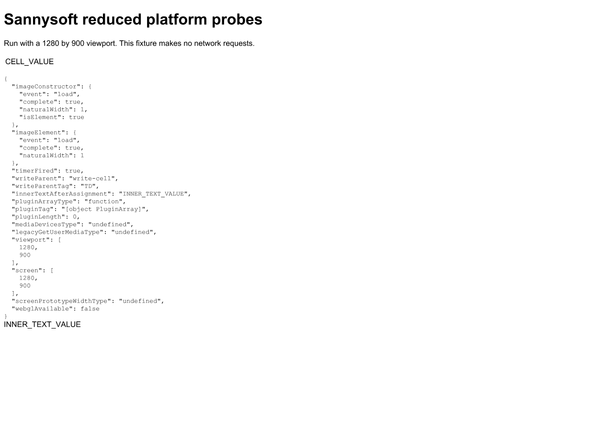

# Sannysoft first P2: CLI scripts viewport dimensions in headless sessions

Implemented on 2026-10-08 in `d:\Broiler.Browser`.
This completes the first P2 item (Problem 5) in the [investigation plan](sannysoft-investigation-2026-10-08.md).

## Problem Statement

Previously:
1. `HeadlessBrowser` in `src/Broiler.Browser.Cli/HeadlessBrowser.cs` constructed `BrowserApp.BridgeOptions` without passing a viewport factory:
   ```csharp
   _bridges = new BridgeRecorder(new DomBridgeFactory(
       BrowserApp.BridgeOptions(Network, _profile.DocumentCookies, DocumentFor, options.WrapLayoutView)));
   ```
2. In `PageAnalyzer.cs`, `HeadlessBrowser` was initialized without viewport dimensions, even though `--width` and `--height` were passed to `PageAnalyzer` and used for subsequent layout queries and screenshots.
3. In `CaptureService.cs`, `CaptureAsync`, `CaptureImageAsync`, and `EvaluatePageAsync` initialized `HeadlessBrowser` with default options (no viewport passed).
4. As a result, scripts executed during headless sessions (both `--analyze` and `--capture-image` / `--evaluate-page`) saw the fallback default viewport of `1024×768` for:
   - `window.innerWidth` and `window.innerHeight`
   - `window.outerWidth` and `window.outerHeight`
   - `screen.width` and `screen.height`
   - `screen.availWidth` and `screen.availHeight`
   - `screen.orientation`
   - CSS `@media` queries via `window.matchMedia`
   - Viewport-relative element layout queries (`100vw`, `50vw`, etc.)
   even when rendering or capturing at `1280×900` or other dimensions.
5. In the platform probes fixture (`docs/repros/sannysoft-platform-probes.html`), `probeResults.viewport` and `probeResults.screen` reported `[1024, 768]` instead of the requested `[1280, 900]`.

## Solution

1. **`HeadlessBrowserOptions`**:
   - Added `public Func<Size?>? Viewport { get; init; }` to `HeadlessBrowserOptions`.
   - Updated `HeadlessBrowser`'s constructor to thread `options.Viewport` to `BrowserApp.BridgeOptions(Network, _profile.DocumentCookies, DocumentFor, options.WrapLayoutView, options.Viewport)`.

2. **`PageAnalyzer`**:
   - In `RunPhasesAsync`, initialized `HeadlessBrowser` with `Viewport = () => new Size(_options.Width, _options.Height)`.
   - Now initial scripts, settling loops, layout queries, and the rendering pipeline all execute with the exact viewport specified on the CLI (`--width` and `--height`).

3. **`CaptureService`**:
   - Added `Width` and `Height` properties to `CaptureOptions` (default 1024×768) and `PageEvaluationOptions` (default 1024×768).
   - In `CaptureAsync`, passed `Viewport = () => new Size(options.Width, options.Height)` to `HeadlessBrowser`.
   - In `CaptureImageAsync`, passed `Viewport = () => new Size(options.Width, options.Height)` to `HeadlessBrowser`.
   - In `EvaluatePageAsync`, passed `Viewport = () => new Size(options.Width, options.Height)` to `HeadlessBrowser`.

4. **`Program.cs` (CLI dispatch)**:
   - Updated `RunPageEvaluation` to accept `width` and `height` from CLI arguments and pass them into `PageEvaluationOptions`.
   - Updated `CaptureOptions` instantiation to pass CLI `width` and `height`.
   - Updated batch capture argument building to pass `--width` and `--height` across all modes.
   - Clarified CLI help text for `--width` and `--height` to state they configure both viewport and image size.

## Validation

1. **Platform Probes Fixture (`docs/repros/sannysoft-platform-probes.html`)**:
   - At `--width 1280 --height 900`:
     - `probeResults.viewport`: `[1280, 900]` (previously `[1024, 768]`).
     - `probeResults.screen`: `[1280, 900]` (previously `[1024, 768]`).
     - Report viewport: `1280×900`.
     - Window comparison: `0.0%` difference between headless render and window probe.
   - At `--width 800 --height 600`:
     - `probeResults.viewport`: `[800, 600]`.
     - `probeResults.screen`: `[800, 600]`.
     - Report viewport: `800×600`.
     - Window comparison: `0.0%` difference.

2. **Automated Unit & Integration Tests**:
   - `PageAnalysisTests.Analysis_Initial_Scripts_And_Layout_See_Configured_Viewport`: Verified across `1280×900` and `800×600` that `window.innerWidth`, `screen.width`, `matchMedia`, and layout queries (`50vw`) all agree on the configured viewport dimensions.
   - `CaptureServiceTests.Page_Evaluation_And_Initial_Scripts_See_Configured_Viewport`: Verified across `1280×900` and `800×600` that expression evaluations and initial script mutations reflect the configured viewport dimensions.
   - `CaptureServiceTests.Capture_Image_Passes_Configured_Viewport_To_Initial_Scripts`: Verified `--capture-image` headless execution threads viewport to scripts.
   - `Broiler.Browser.Core.Tests`: 319 passed, 0 failed, 0 skipped.
   - `Broiler.Browser.Cli.Tests`: 223 passed, 0 failed, 0 skipped.


