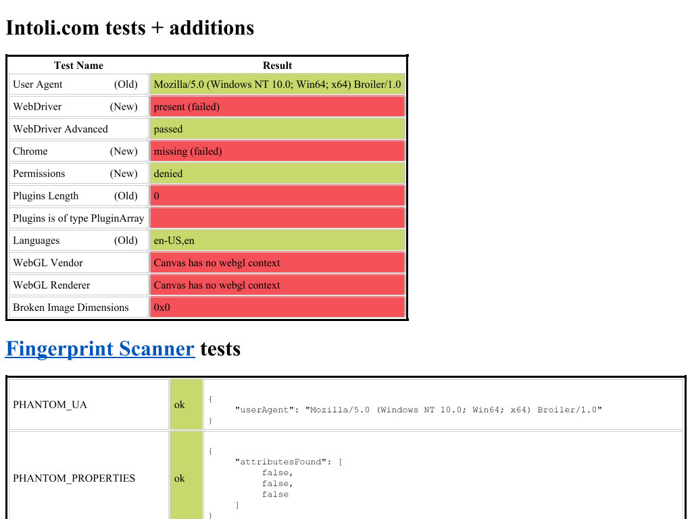

# Sannysoft third P1: Nested document.write() insertion point

Implemented on 2026-10-08 in `D:\Broiler.HtmlBridge`.
This completes the third P1 in the [original investigation](sannysoft-investigation-2026-10-08.md).

## Outcome

Previously:
1. In `D:\Broiler.HtmlBridge\src\Broiler.HtmlBridge.Dom\Features\DocumentWriteBinding.cs`, the bridge discarded the current script if its parent was not `<body>`:
   ```csharp
   if (DomBridgeUtils.ParentEl(currentScript) != mainBody)
       currentScript = null;
   ```
   Any script running inside another element (such as a `<td>`, `<div>`, `<head>`, etc.) fell through to appending its written nodes to the end of `<body>`.
2. On [bot.sannysoft.com](https://bot.sannysoft.com/), each detail table cell (e.g., `navigator.userAgent`, `navigator.cookieEnabled`, `navigator.sendBeacon`, etc.) executed an inline script containing `document.write(navigator.foo)`. All of these detail values escaped their table cells and accumulated at the very end of `<body>` as a concatenated string beginning `trueundefinedundefinedfalsetrueMozilla/5.0...`, leaving the table cells empty.
3. In the reduced test fixture (`docs/repros/sannysoft-platform-probes.html`), `writeParent` was `null` and `writeParentTag` was `"BODY"`.

With this fix:
1. `document.write()` and `document.writeln()` now respect the executing script's true parent element (such as `<td>`), inserting nodes directly after the script inside that parent rather than falling back to `<body>`.
2. Consecutive writes within the same script maintain insertion order by advancing the insertion anchor to the last inserted node.
3. Written fragments are parsed using the script parent's tag name as the HTML context (e.g. `td`, `tr`, `select`, `head`, `div`), falling back to `body`.
4. Intervening DOM mutations that remove the previously inserted anchor gracefully fall back to inserting after the script element or appending to the target parent.
5. In `ScriptEngine`, script elements are resolved dynamically so preceding `document.write` DOM insertions do not shift script element attribution for subsequent scripts.
6. In `docs/repros/sannysoft-platform-probes.html`:
   - `writeParent` is `"write-cell"` (previously `null`).
   - `writeParentTag` is `"TD"` (previously `"BODY"`).
7. On the live [Sannysoft page](https://bot.sannysoft.com/):
   - Every detail table cell now correctly displays its value inside its own `<td>` right after its script.
   - The concatenated string at the bottom of `<body>` is completely gone.



## Implementation

Principal source files in `D:\Broiler.HtmlBridge`:
- `src/Broiler.HtmlBridge.Dom/Features/DocumentWriteBinding.cs`:
  - `HostWriteState` tracking `ScriptIndex`, `CurrentScript`, and `LastInsertedNode` via `ConditionalWeakTable<IDocumentWriteHost, HostWriteState>`.
  - When `host.CurrentScriptIndex` changes, state is updated with the current script element and `LastInsertedNode` is reset.
  - `targetParent` resolves to `scriptParent ?? mainBody`.
  - `contextTag` resolves to `scriptParent.TagName.ToLowerInvariant()` (or `"body"`).
  - Insertion index resolves to `lastIdx + 1` if `LastInsertedNode` is still connected to `targetParent`, or `scriptIdx + 1` if `currentScript` is still in `targetParent`, or appends to `targetParent`.
  - Multiple arguments to `document.write(...text)` are concatenated per HTML spec.
- `src/Broiler.HtmlBridge.Scripting/ScriptEngine.cs`:
  - `classicElements` and `deferredElements` are snapshotted at engine startup; during the execution loop, each script's `CurrentScriptIndex` is dynamically resolved in `bridge.Elements` via `FindScriptIndex`, ensuring insertions made by earlier scripts do not shift subsequent script element indices.
- `tests/Broiler.HtmlBridge.Tests/DocumentWriteBindingTests.cs`:
  - 9 unit tests covering table cells, consecutive writes, multi-element writes, multi-cell scripts, multi-argument writes, writeln, head insertions, post-load fallbacks, and recovery from intervening anchor removal.

## Validation

| Check | Result |
| --- | --- |
| `DocumentWriteBindingTests` | 9 passed, 0 failed |
| Full Release suite | 1,985 passed, 21 skipped, 0 failed |
| Full Release-VM configuration suite | 2,041 passed, 21 skipped, 0 failed |
| Engine-neutrality guard | Passed; 0 violations across 5 projects / 342 source files |
| Platform probes fixture (`sannysoft-platform-probes.html`) | `writeParent: "write-cell"`, `writeParentTag: "TD"` |
| Live page (`https://bot.sannysoft.com/`) | Detail cells populated in place; no values accumulated at bottom of body |
